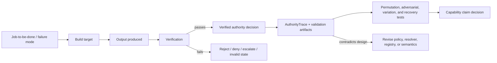
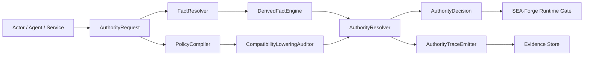
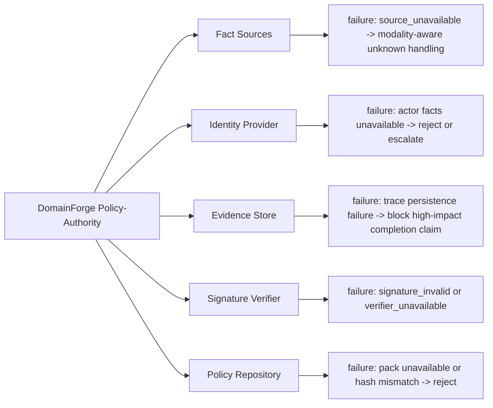
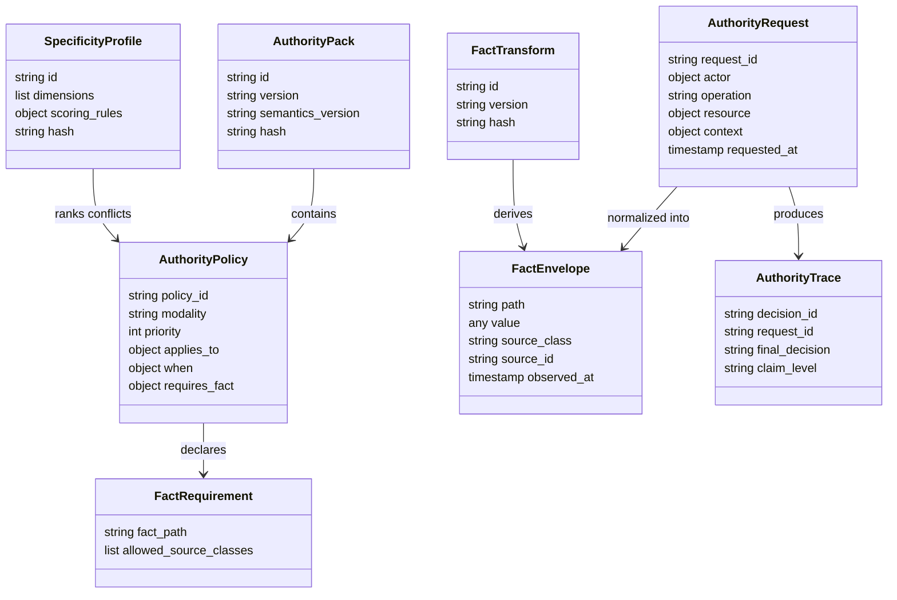
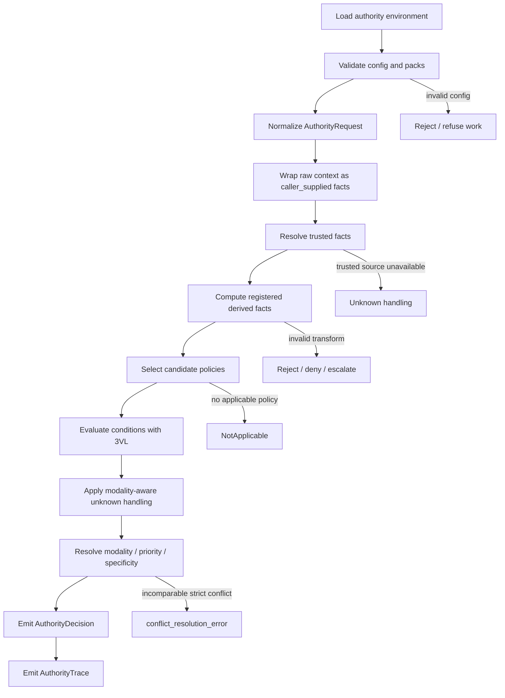
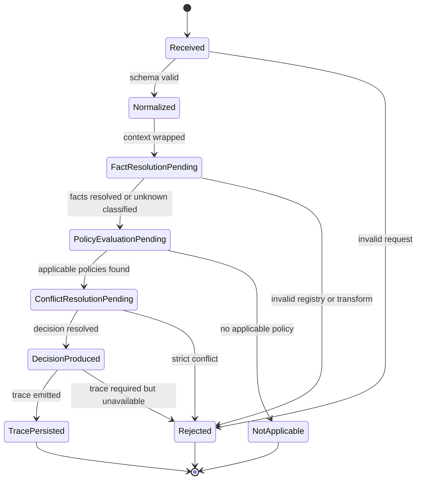
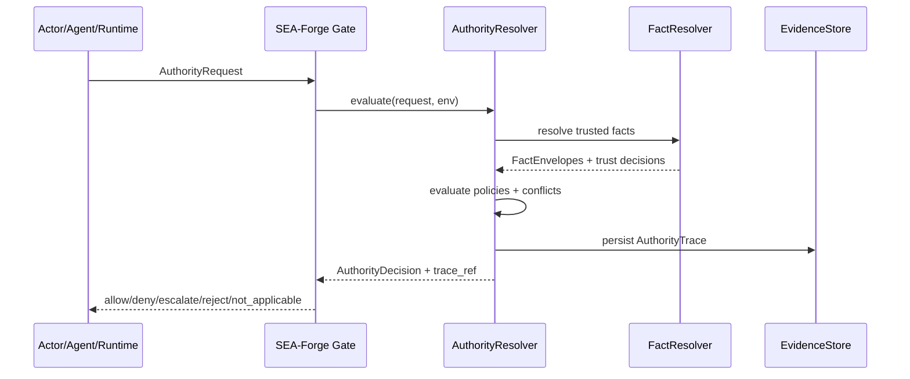
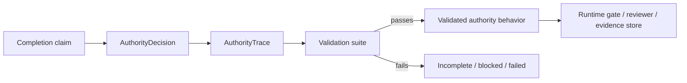
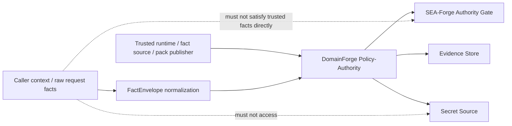

# DomainForge Policy-Authority Language Specification v4

Status: Specification v4

Scope: DomainForge / SEA-Forge policy-authority language, resolver semantics, fact provenance, authority tracing, conformance testing, and governed autonomous-action enforcement.

Purpose: Define an implementation-ready authority language and resolver contract that lets DomainForge express executable business authority and lets SEA-Forge govern high-impact human-AI or software actions against trusted facts, deterministic semantics, and reviewable evidence.

Owner: GodSpeed AI / DomainForge / SEA-Forge Architecture

---

## 0. Spec Frame

A useful implementation spec MUST let a developer, agent, reviewer, or operator answer these eight questions without guessing:

1. What should be built?
2. What result should it produce?
3. How will we know the result is real?
4. What capability should get stronger after repeated successful use?
5. What evidence proves the capability claim?
6. What fails safely?
7. What must repeat until reliable?
8. What changes when evidence disagrees with the design?

If the generated spec cannot answer these questions, it is incomplete.

### Spec Proof Loop



---

## Normative Language

The key words `MUST`, `MUST NOT`, `REQUIRED`, `SHOULD`, `SHOULD NOT`, `RECOMMENDED`, `MAY`, and `OPTIONAL` in this document are to be interpreted as described in RFC 2119.

`Implementation-defined` means the behavior is part of the implementation contract, but this specification does not prescribe one universal policy. Implementations MUST document the selected behavior.

---

## 1. Problem Statement

DomainForge Policy-Authority solves the problem of making business authority executable, deterministic, fact-grounded, traceable, and safe enough for governed autonomous or semi-autonomous work.

### Job-to-be-done

When an organization, software system, AI agent, service account, or human operator needs to perform a high-impact action, they need DomainForge Policy-Authority to determine whether the action is allowed, denied, escalated, rejected, or not applicable so that autonomous and human-AI work can be governed before it changes files, APIs, repositories, infrastructure, records, workflows, or other sensitive resources.

### Current failure mode

* Policies live in documents, tickets, Slack threads, tribal knowledge, compliance systems, or legal interpretations, but are not executable at the moment of action.
* AI agents and automation tools may act from prompts, tool descriptions, or incomplete context rather than explicit authority boundaries.
* Runtime decisions may depend on untrusted caller-supplied facts, ambiguous policy specificity, unsafe unknown handling, or undocumented resolver behavior.
* Audit logs may show what happened without proving that the authority decision was semantically valid.
* Compatibility syntax may collapse target matching and condition evaluation, creating silent semantic drift during lowering.
* Generated code or autonomous actions may be reported as “done” without a replayable evidence record.

### Why existing approaches fail

Existing approaches fail because they often treat governance as one of the following:

* a policy document,
* a checklist,
* a post-action audit trail,
* a prompt instruction,
* a role-based access rule without contextual facts,
* a workflow convention,
* or a human review queue.

These approaches do not reliably answer:

```text
Who is acting?
What are they trying to change?
Which domain authority applies?
Which facts are trusted?
Which facts are unknown?
Which policy wins if policies conflict?
Which evidence proves the decision?
Can the decision be replayed?
```

### Important boundary

* DomainForge Policy-Authority is an executable authority semantics and resolver specification.
* DomainForge Policy-Authority is not a complete legal reasoning system, a general-purpose compliance platform, or a formal proof system by default.
* Successful execution means a deterministic, traceable, evidence-backed authority decision under declared semantics, not universal proof that all organizational policy is correct.

---

## 2. Goals and Non-Goals

### 2.1 Goals

* Define an authority language for `Permission`, `Prohibition`, `Obligation`, and `Override` policies.
* Define a deterministic resolver contract for evaluating actions against policy packs.
* Require fact provenance for all facts used in authority evaluation.
* Prevent untrusted caller-supplied context from satisfying trusted fact requirements.
* Prevent trust laundering through derived facts.
* Define modality-aware unknown handling.
* Define deterministic specificity resolution using vector dominance.
* Forbid scalar aggregation of specificity vectors.
* Define compatibility lowering boundaries.
* Require replayable `AuthorityTrace` artifacts.
* Separate audit evidence, validation evidence, and formal proof evidence.
* Define required conformance tests, adversarial fixtures, and definition of done.

### 2.2 Non-Goals

* Prove all business policies legally or ethically correct.
* Replace human judgment for ambiguous, exceptional, or high-risk cases.
* Infer organizational authority from arbitrary prose alone.
* Trust raw caller context by default.
* Allow autonomous systems to act without authority boundaries.
* Guarantee that all downstream systems enforce the decision correctly.
* Provide a complete GRC product by itself.
* Provide universal formal verification unless formal proof artifacts are separately implemented.

---

## 3. Outcome Contract

### 3.1 Output Produced

The system MUST produce an `AuthorityDecision` and an `AuthorityTrace` for each evaluated authority request.

The primary output is:

```text
AuthorityDecision + AuthorityTrace
```

The `AuthorityDecision` MUST be one of:

```text
Allow
Deny
Escalate
NotApplicable
Reject
```

The `AuthorityTrace` MUST include enough information to replay the decision under the same:

```text
IR
authority packs
fact envelopes
fact source registry
fact transform registry
specificity profile
unknown handling config
compatibility lowering rules
resolver implementation version
resolver semantics version
semantic hash
```

Output fields / contents / side effects:

* `decision_id`
* `request_id`
* `final_decision`
* `ir_hash`
* `pack_hashes`
* `resolver_version`
* `resolver_semantics_version`
* `resolver_semantics_hash`
* `specificity_profile_id`
* `specificity_profile_hash`
* `unknown_handling_config_hash`
* `compatibility_lowering_version`
* `action_request_hash`
* `fact_envelopes`
* `fact_trust_decisions`
* `derived_fact_lineage`
* `candidate_policies`
* `applicable_policies`
* `incomparable_policies`
* `unknown_decisions`
* `compatibility_lowering_decisions`
* `conflict_resolution_steps`
* `claim_level`
* `validation_suite_ref`
* `created_at`

### 3.2 Outcome Verified

The output counts as a verified outcome only when:

* the resolver produces the expected decision for the given request;
* the `AuthorityTrace` is complete enough for replay;
* all trusted facts satisfy their declared fact requirements;
* unknown handling follows the declared modality-aware defaults or explicit policy config;
* policy conflicts resolve deterministically or fail safely;
* all relevant conformance and adversarial fixtures pass.

Verification signals:

* golden authority fixture passes;
* policy-order permutation test passes;
* pack-order permutation test passes;
* fact injection test passes;
* fact omission test passes;
* derived fact anti-laundering test passes;
* compatibility lowering test passes;
* trace completeness test passes;
* mutation tests catch known-bad resolver mutations.

A run MUST NOT be reported as complete when:

* the final decision exists but the trace is incomplete;
* the trace omits replay-critical semantic metadata;
* a fact used in evaluation lacks a `FactEnvelope`;
* a caller-supplied fact satisfies a trusted fact requirement;
* an override applies from unknown or untrusted facts;
* specificity comparison uses scalar aggregation;
* ambiguous compatibility syntax is silently lowered;
* validation fixtures are skipped but reported as passed;
* audit evidence is described as formal proof without formal proof artifacts.

### 3.3 Consumer and Handoff

The outcome is consumed by:

* SEA-Forge runtime authority gates;
* AI agent tool-use governors;
* CI/CD and release gates;
* policy reviewers;
* auditors;
* operators;
* evidence stores;
* simulation and replay tools;
* implementation agents;
* downstream workflow systems.

Handoff is complete when:

* the decision has been returned to the caller or enforcing runtime;
* the `AuthorityTrace` has been persisted or emitted to the configured evidence sink;
* any `Escalate`, `Reject`, or policy-conflict condition includes an operator-visible reason;
* any `Unknown` decision includes `unknown_reason` and `availability_classification`;
* any denied high-impact operation is blocked before side effect execution.

If the outcome cannot be verified, the system MUST enter one of:

```text
Reject
Deny
Escalate
Blocked
InvalidAuthorityEnvironment
InvalidPolicyPack
InvalidFactTrust
InvalidCompatibilityLowering
```

and expose a typed error plus trace evidence sufficient for diagnosis.

---

## 4. Capability Claim

After repeated successful use, GodSpeed AI / DomainForge / SEA-Forge should be better able to govern autonomous and human-AI actions against executable business authority.

This capability claim is in scope because the product exists to turn business meaning, trusted facts, policy semantics, and evidence into reusable governed-action infrastructure.

The capability claim is proven only if:

* repeated authority decisions produce deterministic decisions under the same semantics;
* policy and pack order do not change outcomes;
* fact injection and omission attacks fail safely;
* derived facts cannot launder trust;
* ambiguous compatibility expressions are rejected;
* traces support replay and review;
* resolver behavior survives variation across policy modalities, fact states, unknown states, and conflict cases;
* implementation teams can author, test, migrate, and debug policies without relying on undocumented resolver behavior.

The capability claim is not proven by:

* a single demo;
* a trace artifact without validation tests;
* a passing happy-path permission check;
* a post-action audit log alone;
* a prompt instruction telling an agent to obey policy;
* a policy document stored in a repository;
* scalar code coverage without adversarial fixtures;
* “validated” claims without evidence artifacts;
* “formally proven” language without formal proof artifacts.

---

## 5. Evidence and Claim Discipline

This specification uses four claim levels:

* `Evidence-backed`: supported by implementation, tests, logs, proof commands, reviewable artifacts, integration results, traces, or other inspectable evidence.
* `Partially proven`: implemented in meaningful pieces, but not yet proven end-to-end, under variation, or in the target environment.
* `Assumption`: required for the design to hold, but not yet proven.
* `Roadmap`: intended or possible future behavior that is not required for current conformance.

### Claim table

| Claim                                                         | Level                                | Required evidence                                      | Current evidence         | Gap                                              |
| ------------------------------------------------------------- | ------------------------------------ | ------------------------------------------------------ | ------------------------ | ------------------------------------------------ |
| Resolver decisions are deterministic under declared semantics | Evidence-backed when implemented     | replay tests, golden fixtures, order permutation tests | implementation-dependent | must pass required test suite                    |
| Caller-supplied context is not trusted by default             | Evidence-backed when implemented     | fact envelope tests, override injection fixture        | implementation-dependent | fact source registry must enforce default        |
| Unknown prohibitions deny by default                          | Evidence-backed when implemented     | missing fact fixture, unknown handling trace           | implementation-dependent | modality-aware unknown handling required         |
| Derived facts cannot upgrade trust                            | Evidence-backed when implemented     | derived lineage fixture, transform registry tests      | implementation-dependent | transform registry required                      |
| Compatibility lowering is safe                                | Evidence-backed when implemented     | ambiguous lowering rejection tests                     | implementation-dependent | lowerable subset must be enforced                |
| AuthorityTrace supports replay                                | Validated when replay tests pass     | trace schema, replay fixture                           | implementation-dependent | replay tooling required                          |
| Resolver is formally proven                                   | Roadmap unless proof artifacts exist | proof assistant/model-checking artifacts               | none by default          | formal proof system not required for conformance |

### Evidence taxonomy

#### Audit evidence

Audit evidence records what happened.

Examples:

* `AuthorityTrace`
* `ir_hash`
* `pack_hashes`
* `resolver_version`
* `resolver_semantics_version`
* `fact_envelopes`
* `decision steps`
* `final_decision`

#### Validation evidence

Validation evidence shows the implementation passed declared checks.

Examples:

* golden fixtures;
* property tests;
* permutation tests;
* mutation tests;
* fact injection tests;
* omission tests;
* compatibility lowering tests;
* trace replay tests.

#### Formal proof evidence

Formal proof evidence requires a separate mechanical proof method.

Examples:

* model checking;
* proof assistant artifacts;
* exhaustive finite-state verification;
* formally verified resolver core.

Unless formal proof artifacts exist, this specification MUST NOT claim formal proof.

---

## 6. System Overview

### 6.1 Architecture Pattern

DomainForge Policy-Authority uses the following primary architecture pattern:

* Pattern: deterministic policy compiler + trusted fact resolver + authority decision resolver + evidence trace emitter.
* Examples: compiler, request/response resolver, policy engine, authority gateway, governance runtime, audit/evidence emitter.
* Reason this pattern fits: the system must evaluate requests before action, produce a decision, preserve trace evidence, and support replay.
* Patterns intentionally not used:

  * generic post-action audit logging, because action must be governed before execution;
  * free-form LLM policy interpretation, because authority decisions require deterministic semantics;
  * document-only governance, because policy must be executable;
  * scalar priority-only resolution, because conflict semantics require modality, priority, specificity, and fact handling.

### 6.2 Main Components

1. `PolicyCompiler`

   * Responsibility: parse policy syntax and compile accepted policy forms into canonical IR.
   * Inputs: policy files, authority packs, compatibility syntax, specificity profile references.
   * Outputs: canonical policy IR, pack metadata, compilation diagnostics.

2. `CompatibilityLoweringAuditor`

   * Responsibility: lower only bounded compatibility syntax and reject ambiguous expressions.
   * Inputs: compatibility-form policies.
   * Outputs: first-class `applies_to` and `when` policy structures, or `ambiguous_compatibility_lowering`.

3. `FactSourceRegistry`

   * Responsibility: define trusted source classes, source IDs, allowed fact paths, evidence requirements, freshness rules, and signature requirements.
   * Inputs: registry config.
   * Outputs: trusted fact resolution constraints.

4. `FactResolver`

   * Responsibility: normalize raw request context into `FactEnvelope`, resolve trusted facts, validate provenance, freshness, evidence, signatures, and schemas.
   * Inputs: `AuthorityRequest`, raw context, fact source registry.
   * Outputs: validated `FactEnvelope` objects and fact trust decisions.

5. `FactTransformRegistry`

   * Responsibility: define registered deterministic transforms for derived facts.
   * Inputs: transform declarations.
   * Outputs: versioned pure transforms and lineage metadata.

6. `DerivedFactEngine`

   * Responsibility: compute derived facts only through registered deterministic transforms and prevent trust laundering.
   * Inputs: trusted parent facts, transform registry.
   * Outputs: derived `FactEnvelope` objects and derived fact lineage.

7. `AuthorityResolver`

   * Responsibility: evaluate candidate policies against request, facts, 3VL conditions, unknown handling, conflict resolution, specificity, and priority.
   * Inputs: compiled IR, policy packs, fact envelopes, specificity profile, unknown handling config.
   * Outputs: `AuthorityDecision`.

8. `AuthorityTraceEmitter`

   * Responsibility: produce replayable `AuthorityTrace`.
   * Inputs: request, packs, facts, decision steps, resolver metadata.
   * Outputs: persisted or emitted `AuthorityTrace`.

9. `ValidationSuite`

   * Responsibility: verify conformance through required tests and adversarial fixtures.
   * Inputs: implementation under test, fixture corpus.
   * Outputs: validation report and `validation_suite_ref`.

### 6.3 Component Diagram



### 6.4 External Dependencies

* Fact source systems — used for trusted facts from systems of record.
* Identity provider — used for actor identity, role, group, and service account facts.
* Evidence store — used for persisting `AuthorityTrace`.
* Signature verification system — used for attested facts and signed packs when required.
* Policy repository — used for policy pack storage and versioning.
* Validation runner — used for conformance and adversarial test execution.

Dependency failure behavior is specified in Section 14.

### 6.5 Dependency Diagram



---

## 7. Core Domain Model

### 7.1 Domain Model Scope Rule

The smallest required entity set is:

1. `AuthorityRequest`
2. `AuthorityPolicy`
3. `AuthorityPack`
4. `FactEnvelope`
5. `FactRequirement`
6. `FactSource`
7. `FactTransform`
8. `SpecificityProfile`
9. `UnknownHandlingConfig`
10. `AuthorityDecision`
11. `AuthorityTrace`

This spec exceeds the usual 3-7 core-entity guideline because authority resolution requires explicit modeling of request, policy, facts, trust, transforms, specificity, unknowns, decision, and replay evidence. These are not governance extras; they are the trust boundary.

### 7.2 AuthorityRequest

Purpose: normalized action-evaluation request accepted by the resolver.

Used by: `FactResolver`, `AuthorityResolver`, `AuthorityTraceEmitter`.

Required fields:

* `request_id` (string)

  * Stable identity for correlation, idempotency, and trace linkage.
* `actor` (object)

  * Actor identity context. Must include `id` and may include role, groups, service account, or agent identity.
* `operation` (string)

  * Action under evaluation.
* `resource` (object)

  * Target of the operation. Must include at least `id` or `type`.
* `context` (object)

  * Raw request-supplied context. Defaults to untrusted `caller_supplied`.
* `requested_at` (timestamp)

  * Time the action was requested.

Optional fields:

* `correlation_id` (string)

  * Links to upstream workflow, agent run, PR, ticket, or operation.
* `risk_class` (string)

  * Optional risk classification used for strict/permissive mode selection.
* `metadata` (map)

  * Extension-specific fields that do not directly alter authority unless normalized into facts.

### 7.3 AuthorityPolicy

Purpose: executable rule governing action.

Used by: `PolicyCompiler`, `AuthorityResolver`.

Required fields:

* `policy_id` (string)
* `modality` (enum)

  * Allowed: `Permission`, `Prohibition`, `Obligation`, `Override`.
* `priority` (integer)
* `applies_to` or `applies_to_any`

  * Structural target predicates.
* `when`

  * Condition predicates evaluated using trusted facts and 3VL.
* `requires_fact`

  * Fact requirements for all facts used by the policy.
* `semantics_version`

  * Authority semantics version required by the policy.

Optional fields:

* `override`

  * Required only for override policies.
* `obligation`

  * Required only for obligation policies.
* `description`

  * Human-readable explanation.
* `evidence_ref`

  * Link to policy rationale or approval artifact.

### 7.4 AuthorityPack

Purpose: immutable bundle of policies and semantic requirements.

Used by: `PolicyCompiler`, `AuthorityResolver`.

Required fields:

* `pack.id`
* `pack.version`
* `pack.semantics_version`
* `required_specificity_profile`
* `policies`
* `hash`

Optional fields:

* `signature`
* `owner`
* `created_at`
* `approved_by`
* `evidence_ref`

Pack rejection criteria:

* hash mismatch;
* signature invalid when required;
* semantics version incompatible;
* specificity profile incompatible;
* policy syntax invalid;
* compatibility lowering ambiguous;
* unknown modality config unsupported;
* required fact source undeclared;
* transform reference undeclared.

### 7.5 FactEnvelope

Purpose: provenance-bearing fact used in authority evaluation.

Used by: `FactResolver`, `DerivedFactEngine`, `AuthorityResolver`, `AuthorityTraceEmitter`.

Required fields:

* `path` (string)
* `value` (any JSON-compatible value)
* `source_class` (enum)
* `source_id` (string)
* `observed_at` (timestamp)

Conditional fields:

* `expires_at` — required when freshness matters.
* `evidence_ref` — required when evidence is declared.
* `signature` — required when attestation is declared.
* `confidence` — required when confidence threshold is declared.

Allowed `source_class` values:

```text
caller_supplied
runtime_observed
system_of_record
attested
manual_approval
derived
unknown_source
```

### 7.6 FactRequirement

Purpose: policy-declared trust requirement for a fact path.

Used by: `AuthorityResolver`.

Required fields:

* `fact_path`
* `allowed_source_classes`

Optional fields:

* `allowed_source_ids`
* `max_age`
* `evidence_ref_required`
* `signature_required`
* `minimum_confidence`
* `required_transform`
* `derived_from_source`

### 7.7 FactSource

Purpose: declared trusted fact source.

Used by: `FactResolver`.

Required fields:

* `id`
* `source_class`
* `allowed_paths`
* `evidence_required`
* `signature_required`
* `max_response_latency_ms`

Optional fields:

* `health_endpoint`
* `credential_ref`
* `schema_ref`
* `owner`
* `recovery_hint`

### 7.8 FactTransform

Purpose: registered deterministic transform for derived facts.

Used by: `DerivedFactEngine`.

Required fields:

* `id`
* `version`
* `hash`
* `inputs`
* `output`
* `purity`
* `determinism_tests`

Purity flags MUST include:

* `network_access`
* `filesystem_access`
* `clock_access`
* `random_access`
* `side_effects`
* `global_state_access`

All MUST be `false` for a transform to be eligible for authority-critical derived facts.

### 7.9 SpecificityProfile

Purpose: environment-level specificity semantics.

Used by: `AuthorityResolver`.

Required fields:

* `id`
* `dimensions`
* `scoring_rules`
* `hash`

Default dimensions:

```text
actor
role
action
resource
scope
condition
```

### 7.10 UnknownHandlingConfig

Purpose: modality-aware handling of `Unknown`.

Used by: `AuthorityResolver`.

Default config:

```yaml
unknown_handling:
  permission:
    default: escalate
  prohibition:
    default: deny
  obligation:
    default: escalate
  override:
    default: not_applicable
```

### 7.11 AuthorityDecision

Purpose: final result of authority evaluation.

Required fields:

* `decision_id`
* `request_id`
* `final_decision`
* `reason_code`
* `trace_ref`

Allowed final decisions:

```text
Allow
Deny
Escalate
NotApplicable
Reject
```

### 7.12 AuthorityTrace

Purpose: replayable evidence artifact.

Used by: auditors, validators, runtime gates, operators, and replay tooling.

Required schema is specified in Section 12.

### 7.13 Domain Diagram



### 7.14 Identifiers and Normalization

* Use `request_id` for internal request identity.
* Use `decision_id` for authority-decision identity.
* Use `policy_id` for policy identity.
* Use `pack.id + pack.version + pack.hash` for pack identity.
* Use `fact.path` for fact lookup.
* Normalize fact paths using dot notation with allowed characters `[A-Za-z0-9_.-]`.
* Reject fact paths containing whitespace, shell metacharacters, path traversal tokens, or control characters.
* Normalize modality names to canonical enum values.
* Normalize final decisions to canonical enum values.
* Do not use user-supplied strings as filesystem paths, command arguments, metric labels, or URLs without explicit escaping and collision handling.
* If a string becomes a filesystem path, queue key, cache key, URL path, metric label, or command argument, the implementation MUST define the allowed characters and collision behavior.

---

## 8. Configuration and Input Contract

### 8.1 Configuration Sources and Resolution

Configuration sources, in precedence order:

1. explicit runtime configuration object or CLI argument;
2. environment-specific config file;
3. repository or deployment defaults;
4. built-in safe defaults.

Resolution rules:

* Explicit runtime configuration MUST take precedence over defaults.
* Environment variables MUST NOT globally override config values unless explicitly enabled.
* `$VAR_NAME` indirection is resolved only for fields that explicitly allow it.
* Missing optional fields receive documented defaults.
* Relative paths resolve relative to the configured authority environment root.
* URI fields MUST NOT be rewritten by filesystem path expansion logic.
* Command fields MUST document whether they are invoked through shell, tokenized argv, SDK call, RPC call, or internal function call.

### 8.2 Required Config Fields

| Field                            | Type       | Required | Default                                       | Validation                               |
| -------------------------------- | ---------- | -------: | --------------------------------------------- | ---------------------------------------- |
| `resolver_semantics_version`     | string     |      yes | none                                          | must match supported semantics           |
| `specificity_profile`            | object/ref |      yes | default profile only if explicitly configured | hash required                            |
| `unknown_handling`               | object     |      yes | modality defaults                             | must define all modalities               |
| `fact_sources`                   | list       |      yes | none                                          | each source must declare class and paths |
| `fact_transforms`                | list       |       no | empty                                         | required if derived facts are used       |
| `authority_packs`                | list       |      yes | none                                          | each pack must validate                  |
| `evidence_sink`                  | object/ref |      yes | none                                          | required for high-impact decisions       |
| `strict_mode`                    | boolean    |      yes | true                                          | required for high-impact actions         |
| `compatibility_lowering_version` | string     |      yes | bounded_compatibility_v1                      | supported version only                   |

### 8.3 Config Error Classes

The implementation SHOULD expose typed configuration errors rather than only free-text failures.

Use:

* `missing_config_error`

  * Required config source is absent, unreadable, or not supplied.
* `parse_error`

  * Config syntax cannot be parsed.
* `schema_error`

  * Parsed config is structurally invalid, has wrong types, or fails required-field validation.
* `unsupported_kind_error`

  * A configured mode, source class, transform kind, or backend is not supported.
* `missing_credential_error`

  * Required credential is absent after environment/reference resolution.
* `policy_parse_error`

  * Policy cannot be parsed before use.
* `policy_evaluation_error`

  * Policy fails at runtime because of unknown variables, invalid functions, unsafe interpolation, or evaluation failure.
* `invalid_reload_error`

  * New config was detected but rejected; the last known good config remains active.
* `conflicting_specificity_profile_error`

  * Loaded packs require incompatible specificity profiles.
* `ambiguous_compatibility_lowering`

  * Compatibility expression cannot be safely lowered.
* `invalid_fact_source_error`

  * Fact source is undeclared, unsupported, or invalid.
* `invalid_transform_error`

  * Transform is unregistered, impure, non-deterministic, or hash-mismatched.

Error surface requirements:

* Startup config errors MUST be operator-visible.
* Runtime preflight errors MUST include an error code, concise message, and recoverability hint.
* Error messages MUST NOT print secrets, raw credentials, or excessive config payloads.
* Optional extension config errors MUST NOT break core behavior unless the extension is enabled or required.

### 8.4 Dispatch and Operation Gating

Errors that block all new work:

* missing authority environment;
* invalid resolver semantics version;
* missing or invalid specificity profile;
* unsupported unknown-handling configuration;
* unreadable required authority packs;
* invalid fact source registry;
* invalid evidence sink for high-impact actions;
* resolver semantic hash mismatch.

Errors that fail only the affected operation:

* invalid single request;
* missing fact for one request;
* source unavailable for one fact;
* stale fact for one request;
* caller-supplied fact rejected;
* one policy condition evaluates to unknown;
* one compatibility policy rejected during pack validation when pack rejection is configured permissively.

Do not leave blast radius ambiguous.

### 8.5 Dynamic Reload Behavior

Dynamic reload is RECOMMENDED for long-running SEA-Forge authority gateways, daemons, workers, and agent runtimes.

If dynamic reload is supported:

* The system MUST parse and validate a new effective configuration snapshot before applying it.
* Reloaded config applies to future authority requests.
* In-flight decisions MUST continue under the semantics and config snapshot with which they began.
* Listener, credential, or backend changes MAY require restart unless live rebind is explicitly supported.
* Invalid reloads MUST NOT crash the process.
* Invalid reloads MUST keep the last known good effective configuration active and emit `invalid_reload_error`.

### 8.6 Startup and Preflight Validation

Startup validation:

* The system MUST validate required config before accepting authority requests.
* If startup validation fails, the system MUST refuse work with operator-visible typed error.

Preflight validation:

* The system SHOULD run lightweight validation before high-impact authority decisions.
* Preflight validates only what is needed to safely start the next operation.
* If preflight fails, the system MUST skip or block the affected operation and emit an operator-visible typed error.

Minimum validation checks:

* authority environment loads;
* resolver semantics version supported;
* semantic hash matches;
* authority packs validate;
* specificity profile exists and matches packs;
* unknown handling config covers all modalities;
* fact source registry is valid;
* fact transforms are registered and pure if derived facts are used;
* evidence sink is available for high-impact decisions;
* compatibility lowering version is supported.

### 8.7 Primary Input Contract

The system accepts `AuthorityRequest` from a caller, agent runtime, SEA-Forge gate, CI hook, workflow engine, or API.

Required input fields:

* `request_id` (string) — non-empty, unique or idempotency-safe.
* `actor` (object) — must include actor identity or resolvable identity reference.
* `operation` (string) — must match supported operation syntax.
* `resource` (object) — must identify target type or instance.
* `context` (object) — optional raw facts, untrusted by default.
* `requested_at` (timestamp) — required or filled by trusted runtime.

Invalid input behavior:

* Missing required fields: `Reject`.
* Invalid values: `Reject`.
* Duplicate input: replay prior decision if idempotency key matches and semantic environment is unchanged; otherwise reject as ambiguous.
* Out-of-scope input: `NotApplicable` or `Reject` depending on whether the operation is unsupported or invalid.
* Unsafe input: reject and record typed error.

---

## 9. Operational Flow and State Model

### 9.1 Flow Summary

```text
Load authority environment
  → Validate packs, semantics, specificity, and config
  → Normalize AuthorityRequest
  → Resolve and validate facts
  → Compute derived facts
  → Select candidate policies
  → Evaluate conditions using 3VL
  → Apply modality-aware unknown handling
  → Resolve conflicts by modality, priority, and specificity
  → Produce AuthorityDecision
  → Emit AuthorityTrace
```

### 9.2 Flow Diagram



### 9.3 States

The system uses the following states for an `AuthorityRequest`.

1. `Received`

   * Meaning: request accepted by API or runtime boundary.
   * Entry trigger: request received.
   * Exit trigger: normalization begins.

2. `Normalized`

   * Meaning: request fields parsed and raw context wrapped as caller-supplied facts.
   * Entry trigger: request validation passes.
   * Exit trigger: fact resolution begins.

3. `FactResolutionPending`

   * Meaning: trusted facts are being retrieved and validated.
   * Entry trigger: fact source registry consulted.
   * Exit trigger: all required facts resolved, unknown, or invalid.

4. `PolicyEvaluationPending`

   * Meaning: candidate policies are being selected and evaluated.
   * Entry trigger: fact resolution complete.
   * Exit trigger: condition evaluation complete.

5. `ConflictResolutionPending`

   * Meaning: applicable policies must be resolved by modality, priority, and specificity.
   * Entry trigger: applicable policies determined.
   * Exit trigger: final decision or conflict error.

6. `DecisionProduced`

   * Meaning: final authority decision produced.
   * Entry trigger: resolver completes.
   * Exit trigger: trace emission begins.

7. `TracePersisted`

   * Meaning: replayable evidence recorded.
   * Entry trigger: trace written to evidence sink.
   * Exit trigger: handoff complete.

8. `Rejected`

   * Meaning: request, config, pack, fact, transform, or compatibility expression invalid.
   * Entry trigger: validation failure.
   * Exit trigger: terminal.

9. `Denied`

   * Meaning: action blocked.
   * Entry trigger: final decision `Deny`.
   * Exit trigger: terminal.

10. `Escalated`

* Meaning: human or higher authority review required.
* Entry trigger: final decision `Escalate`.
* Exit trigger: terminal or external review.

11. `NotApplicable`

* Meaning: no policy applies or override not established.
* Entry trigger: no applicable policy or override unknown.
* Exit trigger: terminal.

Distinct terminal states MUST NOT be collapsed into generic failure.

### 9.4 Transition Rules

* `Received → Normalized` when request schema validation passes.
* `Received → Rejected` when required fields are missing or invalid.
* `Normalized → FactResolutionPending` after raw context is wrapped as caller-supplied facts.
* `FactResolutionPending → PolicyEvaluationPending` when facts are resolved, unknown, or invalid with traceable reason.
* `FactResolutionPending → Rejected` when fact source registry or required transform is invalid.
* `PolicyEvaluationPending → ConflictResolutionPending` when candidate and applicable policies are known.
* `PolicyEvaluationPending → NotApplicable` when no policy applies.
* `ConflictResolutionPending → DecisionProduced` when final decision is resolved.
* `ConflictResolutionPending → Rejected` when strict-mode conflict cannot resolve safely.
* `DecisionProduced → TracePersisted` when trace is successfully emitted.
* `DecisionProduced → Rejected` when trace persistence is required but fails.
* `TracePersisted → terminal` after handoff.

### 9.5 State Diagram



### 9.6 Idempotency Rule

Reprocessing the same `AuthorityRequest` MUST produce the same decision and trace-equivalent result if all replay-critical inputs are identical.

Replay-critical inputs include:

* request hash;
* IR hash;
* pack hashes;
* resolver semantics hash;
* fact envelope values and provenance;
* specificity profile hash;
* unknown handling config hash;
* compatibility lowering version.

### 9.7 Transition Triggers

* `RequestReceived` — begins validation.
* `ValidationPassed` — moves request to normalization.
* `ValidationFailed` — rejects request.
* `TrustedFactResolved` — records fact envelope and trust decision.
* `FactUnavailable` — creates unknown decision metadata.
* `TransformApplied` — records derived fact lineage.
* `TransformRejected` — rejects or escalates according to context.
* `PoliciesSelected` — begins condition evaluation.
* `ConditionEvaluated` — records True, False, or Unknown.
* `UnknownHandlingApplied` — records modality-aware default and reason.
* `ConflictDetected` — invokes priority and specificity resolution.
* `TracePersisted` — completes evidence handoff.

### 9.8 Important Nuances

* A successful resolver return does not mean the action itself is complete; it only means the authority decision settled.
* A trace is audit evidence, not formal proof.
* Raw request context is never trusted by default.
* Overrides must be positively established; they cannot arise from unknown, stale, caller-supplied, or untrusted facts.
* Missing prohibition facts deny by default; this must still record whether the cause was omission, unavailability, trust violation, or configuration error.
* Derived facts cannot become more trusted than their least trusted parent by default.
* Specificity vectors must never be scalar-aggregated.
* Compatibility syntax is convenience syntax, not a license to infer policy intent.

---

## 10. Core Behavior Requirements

### 10.1 Policy Compilation

* The implementation MUST parse supported policy syntax into canonical IR.
* The implementation MUST reject invalid policy syntax.
* The implementation MUST reject ambiguous compatibility lowering.
* The implementation MUST include policy IDs, modalities, priorities, targets, conditions, and fact requirements in the compiled IR.
* The implementation SHOULD provide diagnostics that name the invalid policy and location.

### 10.2 Authority Pack Loading

* The implementation MUST validate pack hash before runtime use.
* The implementation MUST validate pack semantics version compatibility.
* The implementation MUST reject packs requiring incompatible specificity profiles in strict mode.
* The implementation MUST NOT use first-loaded-wins for specificity profiles.
* The implementation MAY reject individual incompatible packs in permissive mode if traceable.

### 10.3 Fact Handling

* The implementation MUST wrap every fact used in evaluation as a `FactEnvelope`.
* The implementation MUST treat raw request context as `caller_supplied`.
* The implementation MUST reject or classify facts from undeclared sources as untrusted.
* The implementation MUST enforce freshness, evidence, signature, and confidence requirements when declared.
* The implementation MUST include fact trust decisions in `AuthorityTrace`.

### 10.4 Derived Fact Handling

* The implementation MUST compute derived facts only through registered deterministic transforms.
* The implementation MUST reject unregistered transforms.
* The implementation MUST reject transforms that access network, filesystem, clock, randomness, global mutable state, or side effects.
* The implementation MUST preserve derived fact lineage in the trace.
* The implementation MUST NOT allow derived facts to upgrade trust by default.
* The implementation MAY support explicit trust-equivalence rules only if separately declared and validated.

### 10.5 Three-Valued Logic

* The implementation MUST evaluate conditions using `True`, `False`, and `Unknown`.
* The implementation MUST preserve `Unknown` through `NOT`.
* The implementation MUST NOT collapse `Unknown` to `True` or `False`.
* The implementation MUST apply modality-aware unknown handling after condition evaluation.

### 10.6 Unknown Handling

* Permission unknown MUST default to `Escalate`.
* Prohibition unknown MUST default to `Deny`.
* Override unknown MUST default to `NotApplicable`.
* Obligation unknown MUST default to `Escalate`.
* Every unknown-handling decision MUST include `unknown_reason`.
* Every unknown-handling decision MUST include `availability_classification`.

### 10.7 Specificity Resolution

* The implementation MUST compute a `SpecificityVector` for candidate policies.
* The implementation MUST compare vectors by dominance only.
* The implementation MUST NOT sum, average, weight-sum, max, lexicographically sort, or otherwise scalarize specificity vectors.
* Equal-priority incomparable policies MUST produce `conflict_resolution_error` in strict mode.
* Equal-priority incomparable policies MUST escalate in permissive mode.

### 10.8 Conflict Resolution

The implementation MUST resolve conflicts in this order:

```text
1. Reject invalid environment or request.
2. Select candidate policies by structural target predicates.
3. Evaluate conditions using trusted facts and 3VL.
4. Apply modality-aware unknown handling.
5. Determine applicable policies.
6. Apply modality precedence where declared.
7. Apply priority.
8. Apply specificity vector dominance.
9. Fail closed or escalate unresolved conflicts.
10. Emit AuthorityTrace.
```

Default modality precedence:

```text
Reject > Deny > Escalate > Allow > NotApplicable
```

Overrides do not automatically outrank prohibitions. Overrides apply only when positively established and declared override semantics permit them.

### 10.9 Completion Rules

The system MAY claim completion only when all are true:

* `AuthorityDecision` produced;
* `AuthorityTrace` produced;
* trace includes replay-critical metadata;
* trusted fact requirements evaluated;
* unknown handling decisions recorded;
* specificity and conflict resolution recorded;
* high-impact operation is blocked, allowed, escalated, rejected, or marked not applicable according to declared semantics;
* required proof or validation suite passes for release claims.

The system MUST report incomplete, blocked, or failed when:

* trace is missing or incomplete;
* fact provenance cannot be established;
* required source registry is unavailable;
* transform registry is invalid;
* compatibility lowering is ambiguous;
* conflicting specificity profiles exist;
* resolver semantics hash mismatches;
* evidence sink is required but unavailable.

---

## 11. Execution / Integration Contract

### 11.1 Invocation Contract

* Invocation method: API call, SDK call, CLI command, local library call, or SEA-Forge runtime gate.
* Required parameters:

  * `AuthorityRequest`
  * authority environment config
  * authority pack refs
  * resolver semantics version
  * evidence sink config
* Working directory / runtime context:

  * implementation-defined, but must not use caller-controlled paths without normalization.
* Authentication / authorization:

  * caller identity must be established by trusted runtime or identity provider.
* Timeout:

  * fact source and resolver timeouts must be configured.
  * timeout in trusted fact source resolution becomes `unknown_reason = timeout`.

### 11.2 Response Contract

Success response includes:

* `decision_id`
* `request_id`
* `final_decision`
* `reason_code`
* `trace_ref`
* optional `operator_action_hint`

Failure response includes:

* `error.code`
* `error.message`
* `error.recoverable`
* `trace_ref` if partial trace exists
* `operator_action_hint`

### 11.3 Sequence Diagram



### 11.4 External Side Effects

The system may change:

* evidence store by writing `AuthorityTrace`;
* metrics store by emitting counters;
* logs by writing structured events;
* escalation queue by creating review item;
* runtime gate by returning allow/deny/escalate/reject decision.

The system MUST NOT change:

* target business resource before an `Allow`;
* policy packs during evaluation;
* fact sources;
* caller-supplied context;
* authority semantics version during in-flight decision;
* external systems except evidence, metrics, logs, and escalation surfaces.

---

## 12. Evidence, Proof, and Observability

### 12.1 Required Evidence Artifacts

For every completed authority decision, the system MUST preserve:

* `AuthorityTrace`;
* request hash;
* IR hash;
* pack hashes;
* resolver version;
* resolver semantics version;
* resolver semantics hash;
* fact envelopes;
* fact trust decisions;
* derived fact lineage;
* unknown decisions;
* compatibility lowering decisions;
* conflict resolution steps;
* final decision;
* validation suite reference when claim level is `validated`.

Evidence location / retention:

* Storage: configured evidence sink.
* Retention: implementation-defined, but high-impact decisions SHOULD be retained according to audit and compliance requirements.
* Access: restricted to authorized operators, auditors, reviewers, or replay tooling.

### 12.2 AuthorityTrace Required Schema

```json
{
  "decision_id": "string",
  "request_id": "string",

  "ir_hash": "string",
  "pack_hashes": ["string"],

  "resolver_version": "string",
  "resolver_semantics_version": "string",
  "resolver_semantics_hash": "string",

  "specificity_profile_id": "string",
  "specificity_profile_hash": "string",
  "specificity_profile_source": "environment | pack_required",
  "specificity_profile_conflicts": [],

  "unknown_handling_config_hash": "string",
  "compatibility_lowering_version": "string",

  "action_request_hash": "string",

  "fact_envelopes": [],
  "fact_trust_decisions": [],
  "derived_fact_lineage": [],

  "candidate_policies": [],
  "applicable_policies": [],
  "incomparable_policies": [],

  "unknown_decisions": [],

  "compatibility_lowering_decisions": [],

  "conflict_resolution_steps": [],

  "final_decision": "Allow | Deny | Escalate | NotApplicable | Reject",

  "claim_level": "audit_backed | validated | formally_proven",
  "validation_suite_ref": "string",

  "created_at": "timestamp"
}
```

### 12.3 Fact Trust Decision Entry

```json
{
  "fact_path": "customer.credit_status",
  "required_sources": ["system_of_record", "derived"],
  "observed_source": "caller_supplied",
  "trusted": false,
  "reason": "source_class_not_allowed",
  "evidence_ref": null
}
```

### 12.4 Unknown Decision Entry

```json
{
  "policy_id": "block_credit_hold_shipping",
  "unknown_handling_applied": true,
  "unknown_modality": "Prohibition",
  "unknown_default_result": "Deny",
  "unknown_reason": "source_unavailable",
  "affected_fact_paths": ["customer.credit_status"],
  "fact_source_ids": ["credit-service"],
  "availability_classification": "availability_failure",
  "operator_action_hint": "check upstream credit-service availability"
}
```

### 12.5 Derived Fact Lineage Entry

```json
{
  "fact_path": "customer.credit_status",
  "transform_id": "credit_status_normalizer",
  "transform_version": "1.0.0",
  "transform_hash": "sha256:...",
  "input_fact_paths": ["customer.raw_credit_status"],
  "input_source_classes": ["system_of_record"],
  "effective_trust": "system_of_record",
  "trust_upgrade_applied": false
}
```

### 12.6 Proof Commands or Review Procedures

The following proof commands, checks, or review procedures verify the outcome:

```text
run golden authority fixtures
run policy order permutation tests
run pack order permutation tests
run fact injection adversarial tests
run fact omission adversarial tests
run derived fact anti-laundering tests
run compatibility lowering tests
run AuthorityTrace replay tests
run mutation tests against known-bad resolver mutations
```

A proof passes when all required fixtures pass and skipped tests are reported as skipped, not passed.

A proof fails when any required fixture fails, any required trace field is absent, or any known-bad resolver mutation survives.

### 12.7 Evidence Flow Diagram



### 12.8 Logs, Metrics, and Traces

Required log context:

* `request_id`
* `decision_id`
* `actor.id`
* `operation`
* `resource.type`
* `final_decision`
* `resolver_semantics_version`
* `trace_ref`

Required metrics:

* `authority_decision_count_by_result`
* `unknown_deny_count_by_reason`
* `unknown_escalate_count_by_reason`
* `unknown_not_applicable_count_by_reason`
* `source_unavailable_count_by_source_id`
* `trust_violation_count_by_actor`
* `caller_omission_count_by_actor`
* `attack_suspected_count`
* `compatibility_lowering_rejection_count`
* `specificity_conflict_count`
* `trace_persistence_failure_count`

Required traces/events:

* `authority_request_received`
* `fact_trust_decision_recorded`
* `derived_fact_lineage_recorded`
* `unknown_handling_applied`
* `specificity_conflict_detected`
* `compatibility_lowering_rejected`
* `authority_decision_produced`
* `authority_trace_persisted`

---

## 13. Repeatability and Variation Requirements

The system MUST be validated beyond one happy path.

### 13.1 Required variation cases

* Permission with trusted fact.
* Permission with missing fact.
* Prohibition with trusted fact.
* Prohibition with missing fact.
* Override with trusted manual approval.
* Override with caller-supplied fake approval.
* Obligation with unknown fact.
* Equal-priority policies with strict specificity dominance.
* Equal-priority policies that are incomparable.
* Conflicting specificity profiles.
* Derived fact from trusted parent.
* Derived fact from caller-supplied parent.
* Simple compatibility lowering.
* Ambiguous compatibility expression.
* Negated condition predicate.
* Negated structural predicate.

### 13.2 Required recovery cases

* Fact source unavailable.
* Evidence sink unavailable.
* Invalid reload.
* Stale fact.
* Signature invalid.
* Transform registry unavailable.
* Resolver semantics hash mismatch.
* Pack hash mismatch.
* Policy syntax invalid.
* Ambiguous compatibility lowering.

A capability claim remains unverified until the required variation and recovery cases pass.

---

## 14. Failure Model and Recovery Strategy

### 14.1 Failure Classes

1. `invalid_authority_environment`

   * Symptoms: missing or incompatible semantics, specificity profile, unknown config, or required registry.
   * Required behavior: reject or refuse work; do not evaluate authority.

2. `invalid_policy_pack`

   * Symptoms: hash mismatch, incompatible semantics, invalid syntax, invalid signature, unsupported modality.
   * Required behavior: reject pack; in strict mode refuse environment; in permissive mode reject pack with trace.

3. `fact_trust_violation`

   * Symptoms: caller-supplied fact used where trusted fact required; stale fact; missing evidence; invalid signature.
   * Required behavior: apply modality-aware unknown handling or reject according to policy.

4. `source_unavailable`

   * Symptoms: trusted fact source unreachable, timed out, or unhealthy.
   * Required behavior: record unknown reason and availability classification; apply modality-aware unknown handling.

5. `invalid_transform`

   * Symptoms: unregistered transform, hash mismatch, impurity, non-determinism, invalid parent facts.
   * Required behavior: reject derived fact; apply unknown handling or reject operation.

6. `specificity_conflict`

   * Symptoms: equal-priority applicable policies are incomparable.
   * Required behavior: strict mode conflict error; permissive mode escalate.

7. `ambiguous_compatibility_lowering`

   * Symptoms: structural OR, negative structural predicates, implicit multi-target expansion, mixed ambiguity.
   * Required behavior: reject policy or pack; do not silently lower.

8. `trace_persistence_failure`

   * Symptoms: evidence sink unavailable or trace write fails.
   * Required behavior: high-impact completion claim blocked; operation denied, rejected, or escalated according to runtime policy.

### 14.2 Safe Failure Requirements

On failure, the system MUST:

* preserve available diagnostic evidence;
* avoid performing the governed action unless `Allow` is valid and trace requirements are satisfied;
* emit typed error;
* include recoverability hint when possible;
* distinguish availability failure from trust violation;
* fail closed for high-impact actions;
* avoid leaking secrets.

On failure, the system MUST NOT:

* allow from unknown permission;
* apply override from unknown;
* weaken prohibition through omitted facts;
* trust caller facts by default;
* scalar-aggregate specificity;
* silently lower ambiguous compatibility expressions;
* claim formal proof from trace artifacts.

### 14.3 Recovery Behavior

Recoverable failures:

* `source_unavailable` → retry fact source according to policy, classify as availability failure, apply unknown handling.
* `invalid_reload_error` → keep last known good config active.
* `trace_persistence_failure` → retry evidence write; if still unavailable, block high-impact completion.
* `stale_fact` → refresh from trusted source if possible.
* `signature_verifier_unavailable` → classify as source/verification unavailable and apply unknown handling.

Non-recoverable failures:

* `resolver_semantics_hash_mismatch` → reject environment.
* `pack_hash_mismatch` → reject pack.
* `conflicting_specificity_profile_error` in strict mode → reject environment.
* `ambiguous_compatibility_lowering` → reject policy.
* `unregistered_transform` → reject derived fact and dependent policy evaluation.

---

## 15. Security, Safety, and Trust Boundaries

### 15.1 Trust Boundary

Trusted inputs:

* fact envelopes from declared trusted sources;
* runtime-observed facts from trusted runtime;
* signed authority packs when signatures are required;
* registered deterministic transforms;
* resolver semantics config;
* specificity profile config;
* unknown handling config.

Untrusted inputs:

* raw `AuthorityRequest.context`;
* caller-supplied facts;
* unregistered fact sources;
* unregistered transforms;
* policy packs with invalid hashes;
* compatibility expressions not accepted by bounded lowering;
* external service responses without declared source registration.

Trusted actors:

* configured runtime gate;
* authorized policy pack publisher;
* trusted fact source systems;
* authorized manual approvers where declared.

Privileged operations:

* file writes;
* API calls;
* Git commits;
* PR merges;
* infrastructure changes;
* financial actions;
* shipping or release actions;
* policy pack updates;
* fact source registry updates;
* transform registry updates.

### 15.2 Mandatory Safety Requirements

* Raw caller context MUST NOT satisfy trusted fact requirements.
* Privileged overrides MUST require trusted facts.
* Derived facts MUST NOT upgrade trust by default.
* Unknown prohibitions MUST deny by default.
* Unknown overrides MUST be not applicable by default.
* Specificity vectors MUST NOT be scalarized.
* Ambiguous compatibility lowering MUST reject.
* Trace persistence MUST be required for high-impact decisions.
* Secrets MUST NOT be logged, persisted in evidence artifacts, or exposed in errors.

### 15.3 Secret Handling

* Secrets MUST be loaded from a configured secret source.
* Secrets MUST NOT be logged.
* Secrets MUST NOT be copied into `AuthorityTrace`.
* Secret references MAY be recorded, but secret values MUST NOT.

### 15.4 Authorization Requirements

* Only authorized publishers may publish authority packs.
* Only authorized administrators may change fact source registries.
* Only authorized administrators may change transform registries.
* Manual approvals must include approver identity, scope, timestamp, evidence reference, and expiration.
* Runtime callers must be authenticated before authority evaluation when actor identity affects policy.

### 15.5 Trust Boundary Diagram



---

## 16. Reference Algorithms

### 16.1 Resolve Authority Decision

```text
function resolve_authority(request, environment):
  validate_environment(environment)
  validate_semantics(environment.resolver_semantics_version, environment.resolver_semantics_hash)

  packs = load_and_validate_packs(environment.authority_packs)
  specificity_profile = load_specificity_profile(environment)

  if packs conflict with specificity_profile:
    return Reject(conflicting_specificity_profile_error)

  compiled_policies = compile_policies(packs)
  lowered_policies = lower_compatibility_or_reject(compiled_policies)

  normalized_request = normalize_request(request)
  raw_facts = wrap_context_as_caller_supplied(normalized_request.context)

  trusted_facts = resolve_trusted_facts(raw_facts, environment.fact_sources)
  derived_facts = compute_derived_facts(trusted_facts, environment.fact_transforms)

  facts = merge_facts(raw_facts, trusted_facts, derived_facts)

  candidate_policies = select_by_structural_targets(lowered_policies, normalized_request)

  evaluations = []
  for policy in candidate_policies:
    fact_check = validate_fact_requirements(policy, facts)
    condition_result = evaluate_when_with_3vl(policy.when, facts, fact_check)
    unknown_result = apply_modality_unknown_handling(policy.modality, condition_result, fact_check)
    evaluations.append(policy, condition_result, unknown_result)

  applicable = determine_applicable_policies(evaluations)
  decision = resolve_conflicts(applicable, specificity_profile, environment.mode)

  trace = build_authority_trace(request, environment, facts, evaluations, decision)
  persist_trace(trace)

  return decision
```

### 16.2 Compare Specificity

```text
function compare_specificity(policy_a, policy_b, profile):
  vector_a = compute_specificity_vector(policy_a, profile)
  vector_b = compute_specificity_vector(policy_b, profile)

  a_dominates_b = all(vector_a[d] >= vector_b[d] for d in profile.dimensions)
                  and any(vector_a[d] > vector_b[d] for d in profile.dimensions)

  b_dominates_a = all(vector_b[d] >= vector_a[d] for d in profile.dimensions)
                  and any(vector_b[d] > vector_a[d] for d in profile.dimensions)

  if a_dominates_b and not b_dominates_a:
    return A_MORE_SPECIFIC

  if b_dominates_a and not a_dominates_b:
    return B_MORE_SPECIFIC

  return INCOMPARABLE
```

Forbidden implementation:

```text
sum(vector)
weighted_sum(vector)
average(vector)
max(vector)
lexicographic sort
source order
pack order
parse order
hash order
```

### 16.3 Apply Unknown Handling

```text
function apply_unknown_handling(modality, condition_result, fact_status):
  if condition_result != Unknown:
    return condition_result

  reason = classify_unknown_reason(fact_status)
  availability = classify_availability(reason, fact_status)

  if modality == Permission:
    return Escalate with unknown metadata

  if modality == Prohibition:
    return Deny with unknown metadata

  if modality == Override:
    return NotApplicable with unknown metadata

  if modality == Obligation:
    return Escalate with unknown metadata
```

### 16.4 Compute Derived Fact

```text
function compute_derived_fact(transform, input_facts):
  require transform is registered
  require transform hash matches
  require transform purity flags are all false
  require input_facts satisfy transform input requirements

  output = run_pure_transform(transform, input_facts)

  effective_trust = minimum_trust(input_facts)

  return FactEnvelope(
    path = transform.output.path,
    value = output,
    source_class = derived,
    source_id = transform.id + "@" + transform.version,
    observed_at = now_from_trusted_runtime_or_parent_policy,
    evidence_ref = lineage_reference,
    confidence = minimum_confidence(input_facts),
    lineage = input_facts
  )
```

---

## 17. Test and Validation Matrix

### 17.1 Core Conformance Tests

| Area               | Test                        | Expected result                       | Evidence                |
| ------------------ | --------------------------- | ------------------------------------- | ----------------------- |
| Outcome            | authority decision produced | final decision valid enum             | decision fixture        |
| Trace              | trace completeness          | all required trace fields present     | trace schema validation |
| Input validation   | missing actor               | Reject                                | invalid request fixture |
| Config errors      | missing specificity profile | startup/preflight blocked             | typed config error      |
| Startup validation | invalid pack hash           | pack rejected                         | pack validation report  |
| Dynamic reload     | invalid reload              | last known good config remains active | reload test             |
| State transitions  | source unavailable          | unknown handling state reached        | trace unknown decision  |
| Trigger behavior   | FactUnavailable             | unknown reason recorded               | event log               |
| Dispatch gating    | invalid environment         | all new work blocked                  | operator-visible error  |
| Failure handling   | trace persistence failure   | high-impact completion blocked        | failure fixture         |
| Observability      | unknown metrics             | counters emitted                      | metrics snapshot        |
| Security           | caller override injection   | override not applicable               | adversarial fixture     |

### 17.2 Variation and Recovery Tests

| Case                          | Why it matters           | Expected result                         | Evidence            |
| ----------------------------- | ------------------------ | --------------------------------------- | ------------------- |
| Permission with trusted fact  | happy path               | Allow if no stronger prohibition        | golden fixture      |
| Permission with missing fact  | no allow from unknown    | Escalate                                | unknown fixture     |
| Prohibition with missing fact | omission attack defense  | Deny                                    | omission fixture    |
| Override with caller fact     | injection defense        | NotApplicable                           | injection fixture   |
| Derived fact from caller fact | trust laundering defense | requirement not satisfied               | lineage fixture     |
| Source unavailable            | operational diagnosis    | Deny/Escalate with availability failure | recovery fixture    |
| Ambiguous compatibility       | semantic safety          | reject lowering                         | compiler fixture    |
| Specificity incomparability   | conflict safety          | conflict or escalate                    | permutation fixture |

### 17.3 Required Specificity Tests

* `specificity_strict_dominance_resolves`
* `specificity_incomparability_strict_mode_errors`
* `specificity_incomparability_permissive_mode_escalates`
* `specificity_vector_scalar_aggregation_forbidden`
* `policy_order_permutation_does_not_change_decision`
* `pack_order_permutation_does_not_change_decision`
* `conflicting_specificity_profile_rejected`
* `first_loaded_specificity_profile_does_not_win`
* `specificity_profile_hash_in_trace`

### 17.4 Required Fact Provenance Tests

* `raw_context_defaults_to_caller_supplied`
* `caller_supplied_override_rejected`
* `trusted_system_of_record_override_accepted`
* `stale_fact_rejected`
* `missing_evidence_ref_rejected_when_required`
* `signature_invalid_rejected`
* `fact_trust_decision_in_trace`
* `unregistered_fact_source_rejected`

### 17.5 Required Derived Fact Tests

* `derived_fact_from_caller_supplied_does_not_gain_trust`
* `unregistered_transform_rejected`
* `non_deterministic_transform_rejected`
* `transform_with_network_access_rejected`
* `transform_with_clock_access_rejected`
* `derived_fact_lineage_in_trace`
* `derived_fact_satisfies_requirement_only_when_explicitly_allowed`

### 17.6 Required Unknown Handling Tests

* `missing_permission_fact_escalates`
* `missing_prohibition_fact_denies`
* `unknown_override_not_applicable`
* `unknown_obligation_escalates`
* `fact_omission_cannot_convert_deny_to_escalate`
* `source_unavailable_deny_trace_distinguishes_availability_failure`
* `caller_omission_deny_trace_distinguishes_omission`
* `stale_fact_trace_records_stale_reason`
* `untrusted_fact_trace_records_trust_violation`
* `unknown_reason_required_when_unknown_handling_applied`

### 17.7 Required Compatibility Lowering Tests

* `simple_compatibility_conjunction_lowers`
* `ambiguous_structural_or_rejected`
* `negative_structural_predicate_rejected`
* `negated_condition_predicate_lowers_to_when`
* `not_unknown_preserves_unknown`
* `implicit_multi_target_expansion_rejected`
* `ambiguous_compatibility_lowering_rejected`
* `compatibility_lowering_decision_in_trace`

### 17.8 Required Evidence and Claim Tests

* `trace_completeness_required`
* `resolver_version_present`
* `resolver_semantics_version_present`
* `resolver_semantics_hash_present`
* `claim_level_present`
* `audit_trace_not_formal_proof`
* `validation_suite_ref_present`
* `mutation_test_catches_known_bad_resolver`

### 17.9 Required Semantics Version Tests

* `semantics_version_required_for_unknown_default_change`
* `semantics_version_required_for_specificity_profile_change`
* `semantics_version_required_for_fact_trust_rule_change`
* `semantics_version_required_for_compatibility_lowering_change`
* `implementation_refactor_does_not_require_semantics_bump_when_traces_match`

### 17.10 Required Adversarial Fixtures

#### Scalar Specificity Trap

Two policies have equal scalar specificity if summed but are incomparable by vector dominance.

Expected:

```text
strict mode -> conflict_resolution_error
permissive mode -> Escalate
```

#### Conflicting Specificity Profiles

Two packs require incompatible specificity profiles.

Expected:

```text
strict mode -> conflicting_specificity_profile_error
permissive mode -> pack_rejected_with_trace
```

#### Caller-Supplied Override Injection

Caller supplies:

```json
{
  "legal_override": {
    "id": "fake",
    "status": "Approved"
  }
}
```

Expected:

```text
override NotApplicable
fact_trust_violation recorded
caller_supplied fact cannot satisfy trusted requirement
```

#### Derived Fact Trust Laundering

Caller supplies a value that a derived transform normalizes into a privileged fact.

Expected:

```text
derived fact does not gain trust
trusted requirement not satisfied
trust lineage shows caller_supplied parent
```

#### Missing Prohibition Fact

Required fact for prohibition is absent.

Expected:

```text
Deny
unknown_reason = missing
availability_classification = caller_omission or configuration_error
```

#### Source Unavailable Prohibition Fact

Trusted fact source is unavailable.

Expected:

```text
Deny
unknown_reason = source_unavailable
availability_classification = availability_failure
operator_action_hint present
```

#### Unknown Override

Override fact is unavailable or unknown.

Expected:

```text
Override NotApplicable
No allow from unknown override
```

#### Ambiguous Compatibility Lowering

Expression:

```sea
action = "ShipOrder" and (resource = "Order" or resource.type = "SpecialOrder")
```

Expected:

```text
ambiguous_compatibility_lowering
no lowered policy emitted
```

#### Negated Condition Predicate

Expression:

```sea
not customer.credit_status = "Hold"
```

Expected:

```text
lowered to when condition
3VL preserved
not Unknown = Unknown
```

#### Audit Trace Is Not Formal Proof

Trace exists and validation suite passes.

Expected:

```text
claim_level = validated
not formally_proven
```

### 17.11 Real Integration Tests

Real integration tests are REQUIRED when the implementation claims runtime enforcement against real actions.

Required integration cases:

* agent attempts file write;
* agent attempts API call;
* agent attempts commit;
* trusted fact source unavailable;
* evidence sink unavailable;
* policy pack reload;
* compatibility policy migration.

Skipped integration tests MUST be reported as skipped, not passed.

---

## 18. Implementation Checklist / Definition of Done

An implementation is done only when:

* [ ] Primary output `AuthorityDecision + AuthorityTrace` is produced.
* [ ] Outcome verification condition passes.
* [ ] Core domain entities are implemented or represented explicitly.
* [ ] Config sources, precedence, typed error classes, and startup/preflight validation are defined.
* [ ] Dynamic reload behavior is defined as required, optional, or not applicable.
* [ ] Dispatch and operation gating behavior states the blast radius for each relevant error class.
* [ ] Flow branches include success, blocked/failure, and retry/recovery paths.
* [ ] Transition triggers are named and mapped to state changes or side effects.
* [ ] Important nuances in Section 9.8 are implemented or explicitly accepted.
* [ ] Required evidence artifacts are stored and inspectable.
* [ ] Required proof commands or review procedures pass.
* [ ] Failure modes are handled safely.
* [ ] Required logs, metrics, and traces are emitted.
* [ ] Variation cases pass.
* [ ] Recovery cases pass.
* [ ] Security and trust-boundary requirements pass.
* [ ] Optional extensions are marked as implemented, partial, or not implemented.
* [ ] Evidence-backed, partially proven, assumption, and roadmap claims are separated.
* [ ] Raw caller context is treated as caller-supplied.
* [ ] Trusted fact source registry is enforced.
* [ ] Derived fact transform registry is enforced.
* [ ] Derived facts cannot launder trust.
* [ ] Unknown handling is modality-aware.
* [ ] Unknown decisions include reason and availability classification.
* [ ] Specificity comparison uses vector dominance only.
* [ ] Scalar specificity aggregation is forbidden.
* [ ] Conflicting specificity profiles cannot silently co-exist.
* [ ] Compatibility lowering rejects ambiguous expressions.
* [ ] Negated condition predicates preserve 3VL.
* [ ] `AuthorityTrace` contains all replay-critical semantic metadata.
* [ ] Resolver and resolver semantics versions are separate.
* [ ] Semantics-breaking changes increment semantic version.
* [ ] Public claims distinguish audit evidence, validation evidence, and formal proof.
* [ ] All required conformance tests pass.
* [ ] All required adversarial fixtures pass.
* [ ] Mutation tests catch known-bad resolver changes.
* [ ] Policy and pack order permutation tests pass.
* [ ] A developer can answer all eight questions in Section 0 from the spec alone.

---

## Appendix A. Canonical Policy Examples

### A.1 Prohibition with Trusted Fact

```sea
Policy block_credit_hold_shipping per Prohibition priority 100
applies_to:
  action = "ShipOrder"
  resource.type = "Order"
when:
  customer.credit_status = "Hold"
requires_fact:
  customer.credit_status source in [system_of_record, derived]
  customer.credit_status max_age "6h"
  customer.credit_status evidence_ref required true
```

Expected behavior:

```text
If credit_status = Hold from trusted source -> Deny.
If credit_status missing -> Deny by prohibition unknown default.
If credit_status caller_supplied only -> Deny or Reject according to trust violation config.
If credit service unavailable -> Deny with unknown_reason = source_unavailable.
```

### A.2 Permission with Trusted Fact

```sea
Policy allow_clear_order_shipping per Permission priority 50
applies_to:
  actor.role = "WarehouseOperator"
  action = "ShipOrder"
  resource.type = "Order"
when:
  customer.credit_status = "Clear"
requires_fact:
  customer.credit_status source in [system_of_record, derived]
  customer.credit_status max_age "6h"
```

Expected behavior:

```text
If credit_status = Clear from trusted source -> Allow unless stronger prohibition applies.
If credit_status missing -> Escalate.
If credit_status caller_supplied only -> Escalate or Reject according to trust violation config.
```

### A.3 Override with Manual Approval

```sea
Policy legal_override_shipping_hold per Override priority 200
applies_to:
  actor.role = "LegalOps"
  action = "ShipOrder"
  resource.type = "Order"
when:
  legal_override.status = "Approved"
  legal_override.scope = "ShippingHold"
requires_fact:
  legal_override.status source in [system_of_record, attested, manual_approval]
  legal_override.id source in [system_of_record, attested, manual_approval]
  legal_override.status max_age "6h"
override:
  permits = "ShipOrder"
```

Expected behavior:

```text
Caller-supplied legal_override.status must not activate the override.
Unknown override condition -> NotApplicable.
Trusted manual approval with valid evidence may activate override if policy semantics permit it.
```

### A.4 Derived Fact with No Trust Upgrade

```sea
Policy allow_normalized_credit_clear per Permission priority 60
applies_to:
  actor.role = "WarehouseOperator"
  action = "ShipOrder"
  resource.type = "Order"
when:
  customer.credit_status = "Clear"
requires_fact:
  customer.credit_status source in [derived]
  customer.credit_status transform in ["credit_status_normalizer@1.0.0"]
  customer.credit_status derived_from source in [system_of_record]
```

Expected behavior:

```text
Derived fact from system_of_record parent may satisfy requirement.
Derived fact from caller_supplied parent must not satisfy requirement.
Unregistered transform must reject or escalate according to runtime mode.
```

---

## Appendix B. Canonical Summary

DomainForge Policy-Authority makes authority executable by binding policy to:

```text
declared modalities
trusted fact provenance
registered deterministic transforms
three-valued logic
modality-aware unknown handling
deterministic specificity resolution
bounded compatibility lowering
semantic versioning
audit-backed traces
validated conformance tests
```

The operating doctrine is:

```text
No authority without declared semantics.
No decision without trusted facts.
No trust upgrade through derivation.
No allow from unknown permission.
No override from unknown.
No weakened prohibition from omitted facts.
No scalar specificity shortcuts.
No ambiguous compatibility lowering.
No proof claim without proof artifacts.
No completion claim without adversarial validation.
```
