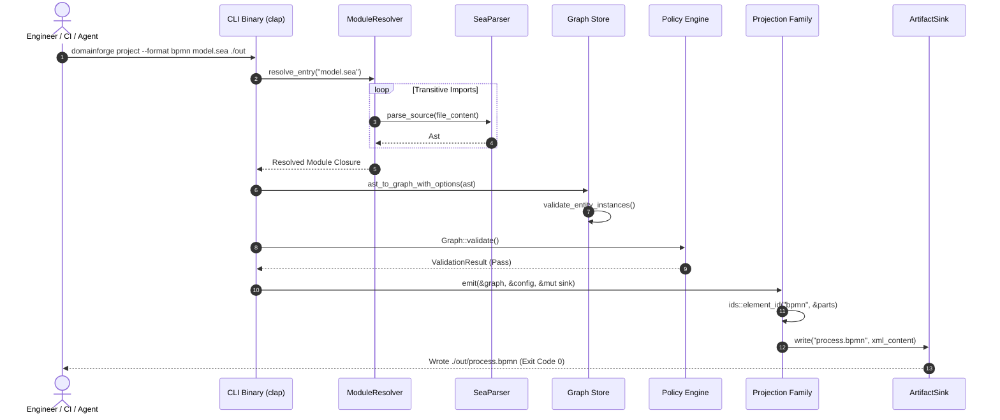
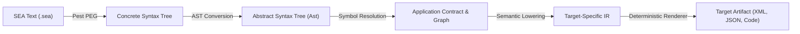

# DomainForge System Architecture

DomainForge is an intermediate representation (IR) compiler, policy evaluation engine, and multi-target projection pipeline. It establishes an authoritative, deterministic semantic model of enterprise architecture from human-readable domain specifications, and projects that meaning into code, diagrams, schemas, formal verification models, and operational environments.

---

## 1. Architectural Principles & Invariants

The entire system is governed by six inviolable engineering rules:

1. **Rust Core is Canonical**: All semantic primitives, graph storage, policy evaluation, unit calculations, and projection algorithms reside in `domainforge-core`. Foreign language bindings (Python, TypeScript, WebAssembly) wrap core types through FFI; they never re-implement business logic.
2. **Deterministic Iteration (`IndexMap`)**: `std::collections::HashMap` is forbidden for policy-relevant state or projection emission. All graph collections use `indexmap::IndexMap` to preserve deterministic insertion order. Two runs on identical inputs produce byte-identical outputs.
3. **Content-Addressed Identity (`ConceptId`)**: Concept identities are minted deterministically via UUID v5 using a fixed DNS namespace UUID (`6ba7b810-9dad-11d1-80b4-00c04fd430c8`) hashed with `<namespace>::<name>`.
4. **Three-Valued Policy Logic**: Business constraints and quantifiers evaluate under Kleene three-valued logic (`True`, `False`, `Null`/`Unknown`), ensuring partial knowledge or unpopulated instances do not generate false positives.
5. **Decoupled Operator Families**: Projections do not talk directly to specific file formats; they adhere to the Operator Family Pattern ([ADR-011](specs/ADR-011-operator-backed-projection-families.md)), consuming an in-memory graph and outputting through a path-safe `ArtifactSink`.
6. **Grammar-First Evolution**: Every syntax modification begins in `domainforge-core/grammar/sea.pest` before AST or graph representations are modified.

---

## 2. Logical Architecture

The logical architecture separates concerns into four distinct layers: Ingestion & Resolution, Semantic Kernel, Projection & Governance, and Foreign Language Surfaces.

```mermaid
graph TB
    subgraph "Layer 1: Ingestion & Resolution"
        RawFiles["Source Files (.sea)"]
        RegistryFile[".sea-registry.toml"]
        PestGrammar["Pest PEG Grammar (sea.pest)"]
        SeaParser["SeaParser (src/parser/mod.rs)"]
        ASTNodes["AST (src/parser/ast.rs)"]
        ModResolver["ModuleResolver (src/module/resolver.rs)"]

        RawFiles & RegistryFile --> ModResolver
        ModResolver --> SeaParser
        PestGrammar -.-> SeaParser
        SeaParser --> ASTNodes
    end

    subgraph "Layer 2: Semantic Kernel"
        ASTNodes --> Lowering["AST Lowering (ast_convert.rs)"]
        Lowering --> GraphStore["Graph Store (src/graph/mod.rs)"]

        subgraph "In-Memory Store (IndexMap)"
            GraphStore --- Ent["Entities & Roles"]
            GraphStore --- Res["Resources & Units"]
            GraphStore --- Flow["Flows & Relations"]
            GraphStore --- Inst["Instances & Values"]
            GraphStore --- Pol["Policies & Modalities"]
        end

        subgraph "Reasoning Engines"
            GraphStore --> PolicyEng["Policy Evaluator (src/policy/core.rs)"]
            GraphStore --> InstVal["Entity Instance Validator (entity_validation.rs)"]
            GraphStore --> UnitReg["Units & Dimensions (src/units/mod.rs)"]
        end
    end

    subgraph "Layer 3: Contracts & Governance"
        ASTNodes --> AppContract["Application Contract (src/application/)"]
        GraphStore --> PackBuild["Semantic Pack Engine (src/semantic_pack/)"]
        PackBuild --> PackSign["Ed25519 Detached Signer (signing.rs)"]
        PackBuild --> PackDiff["Drift & Diff Engine (diff.rs)"]
        GraphStore --> AuthEng["Authority Engine (src/authority/)"]
        AppContract --> Envelope["Canonical Semantic Envelope (envelope.rs)"]
    end

    subgraph "Layer 4: Projections (Operator Families)"
        GraphStore --> ProjEngine["Projection Dispatcher (src/projection/)"]
        ProjEngine --> IDMint["Shared ID Minting (ids.rs)"]
        ProjEngine --> Sink["ArtifactSink (Dir / Memory)"]

        Sink --> OutRDF["Semantic Graph: RDF/OWL (Turtle, JSON-LD)"]
        Sink --> OutCALM["Enterprise Arch: FINOS CALM"]
        Sink --> OutProc["Process/Case: BPMN 2.0 / CMMN 1.1 / ArchiMate"]
        Sink --> OutCode["Domain Code: Python, TypeScript, Rust DDD"]
        Sink --> OutEvent["Events: AsyncAPI 3.0 / CloudEvents 1.0"]
        Sink --> OutFormal["Formal Verif: TLA+ / Alloy / Lean 4"]
        Sink --> OutAI["AI Learning: BAML / DSPy / ZenML"]
    end

    subgraph "Layer 5: Host Interfaces & CLI"
        GraphStore & AppContract & ProjEngine --> CLI["CLI Binary (domainforge)"]
        GraphStore & PolicyEng & PackBuild --> PyO3["Python (PyO3)"]
        GraphStore & PolicyEng & PackBuild --> Napi["TypeScript (napi-rs)"]
        GraphStore & PolicyEng & PackBuild --> WASM["Browser / Node (wasm-bindgen)"]
    end
```



### Diagram Analysis
- **What to Notice**: Information flows strictly top-to-bottom. The Semantic Kernel has no dependencies on the Projection Engine or Host Interfaces. Foreign language bindings (PyO3, napi-rs, WASM) connect directly to the Semantic Kernel without passing through the CLI layer.
- **Why It Matters**: Adding a new projection target or modifying host language bindings cannot destabilize parsing, semantic graph invariants, or policy evaluation logic.
- **What Is Intentionally Omitted**: Low-level allocator configuration (`lol_alloc` for WASM targets), OS-level process management, and external CI test harnesses.

---

## 3. Runtime & Execution Architecture

DomainForge operates as a stateless compiler and reasoning engine. It does not spawn background daemon processes, maintain open database sockets, or require long-lived servers.



### Execution Lifecycles
1. **CLI Execution**: Starts in `domainforge-core/src/bin/domainforge.rs`, parses command-line arguments using `clap`, executes the requested command in-process, prints human or structured JSON output, and terminates with exit code 0 (success) or non-zero (failure).
2. **Library Execution (Python / TypeScript / WASM)**: The host language runtime loads the native shared library (`.so`, `.dylib`, `.dll`, or `.wasm`). Host objects instantiate `Graph` or run `validate()`, invoking Rust code synchronously via FFI. Memory allocated by the Rust core is cleaned up by Rust's RAII drop implementation when the host wrapper is garbage collected.

---

## 4. Dependency Architecture & Workspace Topography

The workspace is organized as a Cargo workspace with language-specific wrappers:

```text
c:\Users\sprim\projects\domainforge/
├── Cargo.toml                       # Workspace root manifest
├── justfile                         # Task runner (tests, enterprise verify, proofs)
├── PROOFS.md                        # Self-proving claims ledger & verified evidence
│
├── domainforge-core/                # CANONICAL RUST CORE (Authoritative)
│   ├── Cargo.toml                   # Core crate dependencies and feature flags
│   ├── grammar/
│   │   └── sea.pest                 # Authoritative Pest PEG grammar
│   ├── src/
│   │   ├── primitives/              # Entity, Resource, Flow, Instance, Policy, etc.
│   │   ├── graph/                   # Graph store & entity instance validation
│   │   ├── parser/                  # PEG parser, AST, schema, printer, linter
│   │   ├── module/                  # ModuleResolver & transitive imports
│   │   ├── policy/                  # Expression evaluation & three-valued logic
│   │   ├── units/                   # Dimensional algebra & unit registry
│   │   ├── semantic_pack/           # Pack schema, builder, signing, diff
│   │   ├── authority/               # Authority resolution & evidence trace
│   │   ├── application/             # ADR-013 operations, records, contracts
│   │   ├── projection/              # 17+ operator family projection renderers
│   │   ├── calm/                    # FINOS CALM export/import
│   │   ├── kg.rs, kg_import.rs      # Knowledge Graph RDF/Turtle export/import
│   │   ├── cli/                     # CLI subcommand implementations
│   │   ├── python/                  # PyO3 bindings bridge
│   │   ├── typescript/              # napi-rs bindings bridge
│   │   └── wasm/                    # wasm-bindgen bindings bridge
│   └── tests/                       # 119+ Rust integration test suites
│
├── domainforge-python/              # Python packaging (maturin, pyproject.toml)
├── domainforge-typescript/          # TypeScript packaging (package.json, napi)
├── tests/                           # Python integration test suite (pytest)
├── typescript-tests/                # TypeScript test suite (vitest / bun)
└── fixtures/                        # Golden test fixtures & cell environments
```

### Dependency Direction Rules
- `domainforge-core` depends only on vetted Rust ecosystem crates (`pest`, `indexmap`, `rust_decimal`, `serde`, `uuid`, `ed25519-dalek`, `xxhash-rust`).
- `domainforge-python` and `domainforge-typescript` depend on `domainforge-core`; `domainforge-core` never depends on python or node packages.
- CLI code is conditionally compiled under the `cli` feature flag. The core library can be built in lightweight headless mode without CLI overhead.

---

## 5. Data Architecture: How Meaning Transforms

Information undergoes strict sequential transformations from authored text to emitted projection:



1. **Concrete Syntax Tree**: Generated by `SeaParser` using the parsing expression grammar in `sea.pest`.
2. **Abstract Syntax Tree (`Ast`)**: Strongly typed Rust representations of declarations (`AstNode::Entity`, `AstNode::Flow`, etc.) with accurate byte offsets and source line/column positions.
3. **Canonical Graph (`Graph`)**: Resolves identifier references into `ConceptId` keys. Unchecked strings become validated entities, resources, and flows.
4. **Target-Specific Intermediate Representation**: Each projection family defines its own IR (e.g. `domain::ir::DomainModel`, `bpmn::ir::BpmnProcess`). Semantic decisions (such as DDD aggregate boundaries or CQRS separation) are made here.
5. **Deterministic Artifact**: Pure renderers format the IR into target files (e.g., Python dataclasses, BPMN XML, Turtle triples). Timestamps are pinned via `--created-at`, guaranteeing byte-level fixpoints.

---

## 6. Trust, Security, and Path Boundaries

- **Filesystem Sandbox Safety**: The projection engine outputs files strictly through `ArtifactSink`. Every output path is checked with `protobuf::validate_output_path()`, which canonicalizes targets and aborts on path traversal attempts (e.g. `../../etc/passwd`).
- **Cryptographic Trust**:
  - Semantic Packs enforce integrity using **Ed25519 digital signatures** covering the canonical SHA-256 content hash of all concept definitions.
  - A pack in `SignatureState::signed` cannot be modified without invalidating its signature.
  - CI validators reject models referencing `ApprovalState::rejected` packs or tampered signatures.
- **Three-Valued Logic Safety**: Unresolved variables or optional fields evaluate to `Null` rather than coercing silently to `false`. This prevents catastrophic false-positive authorization grants in security policies.

---

## 7. Deep Subsystem References

For granular implementation details, explore the dedicated subsystem guides:

- [Parser & Grammar Subsystem](subsystems/parser-grammar.md)
- [Graph Store Subsystem](subsystems/graph-store.md)
- [Policy Engine & Three-Valued Logic](subsystems/policy-engine.md)
- [Units & Dimensions System](subsystems/units-dimensions.md)
- [Semantic Packs & Vocabulary Governance](subsystems/semantic-packs.md)
- [Authority Evaluation Engine](subsystems/authority-engine.md)
- [Application Contracts (ADR-013)](subsystems/application-contracts.md)
- [Projections Engine & Operator Families](subsystems/projections-engine.md)
- [Cross-Language Bindings Architecture](subsystems/language-bindings.md)

---

## Source Trail
- `domainforge-core/grammar/sea.pest` — Authoritative PEG grammar
- `domainforge-core/src/lib.rs` — Core crate root, module declarations, FFI exports
- `domainforge-core/src/graph/mod.rs` — `Graph`, `GraphConfig`, collection indices
- `domainforge-core/src/concept_id.rs` — `ConceptId` UUID v5 content addressing
- `domainforge-core/src/projection/sink.rs` — `ArtifactSink` path containment
- `domainforge-core/src/projection/ids.rs` — `element_id()`, `content_hash()` xxh64 seed 42
- `domainforge-core/src/bin/domainforge.rs` — CLI binary entry point
