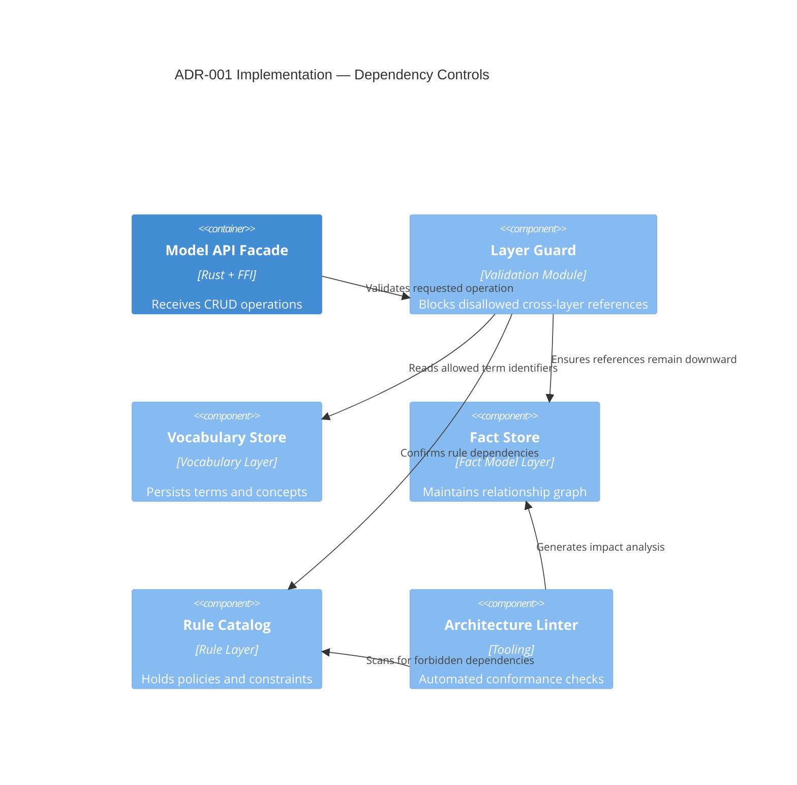

# ADR-001 — Layer Dependency Enforcement

Implementation components enforce the dependency rules enumerated in ADR-001.

```mermaid
%% Source: ADR-001 - Layered Architecture: Vocabulary, Facts, Rules
%% Generated: 2025-11-01
%% Section: Implementation
%% Diagram: C4Component
%% !include https://raw.githubusercontent.com/plantuml-stdlib/C4-PlantUML/main/C4_Component.puml
C4Component
  title ADR-001 Implementation — Dependency Controls
  Container(apiFacade, "Model API Facade", "Rust + FFI", "Receives CRUD operations")
  Component(layerGuard, "Layer Guard", "Validation Module", "Blocks disallowed cross-layer references")
  Component(vocabStore, "Vocabulary Store", "Vocabulary Layer", "Persists terms and concepts")
  Component(factStore, "Fact Store", "Fact Model Layer", "Maintains relationship graph")
  Component(ruleCatalog, "Rule Catalog", "Rule Layer", "Holds policies and constraints")
  Component(linting, "Architecture Linter", "Tooling", "Automated conformance checks")
  Rel(apiFacade, layerGuard, "Validates requested operation")
  Rel(layerGuard, vocabStore, "Reads allowed term identifiers")
  Rel(layerGuard, factStore, "Ensures references remain downward")
  Rel(layerGuard, ruleCatalog, "Confirms rule dependencies")
  Rel(linting, ruleCatalog, "Scans for forbidden dependencies")
  Rel(linting, factStore, "Generates impact analysis")
```

- Related: [Rule validation sequence](ADR-001-sequence-rule-validation.md)
