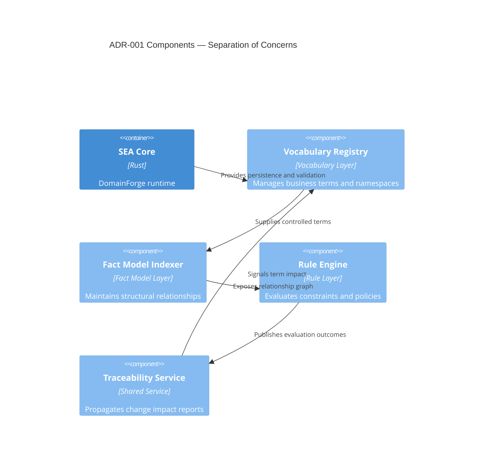

# ADR-001 — Component Responsibilities

Component interactions clarify how each layer in the selected architecture satisfies the decision rationale.

- Related: [Implementation dependency view](ADR-001-component-layer-dependencies.md)
