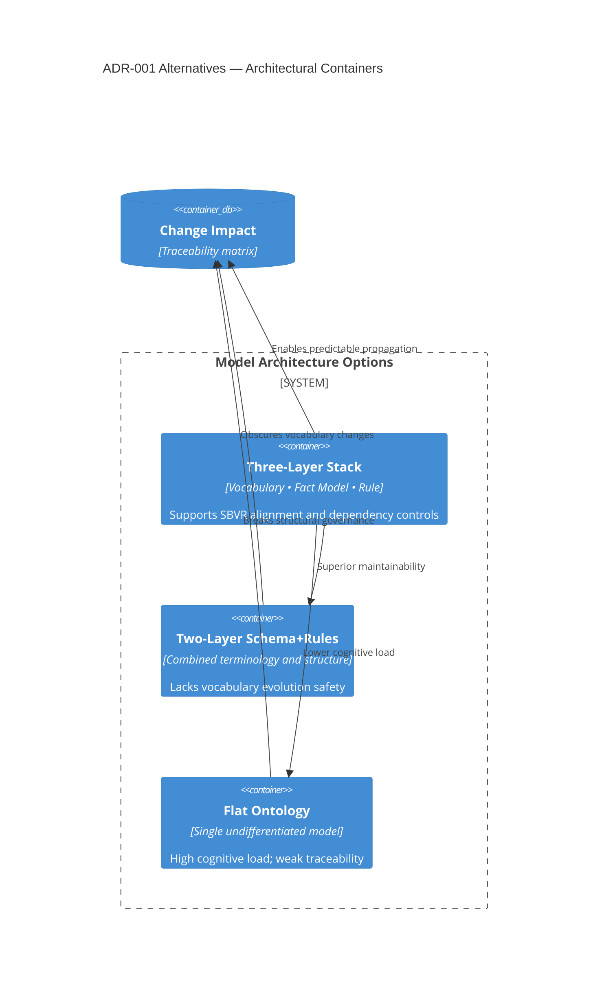

# ADR-001 — Architecture Options Map

This container diagram summarizes the alternative architectures evaluated before selecting the layered approach.

- Related: [Decision evaluation flow](ADR-001-flow-rationale-evaluation.md)
