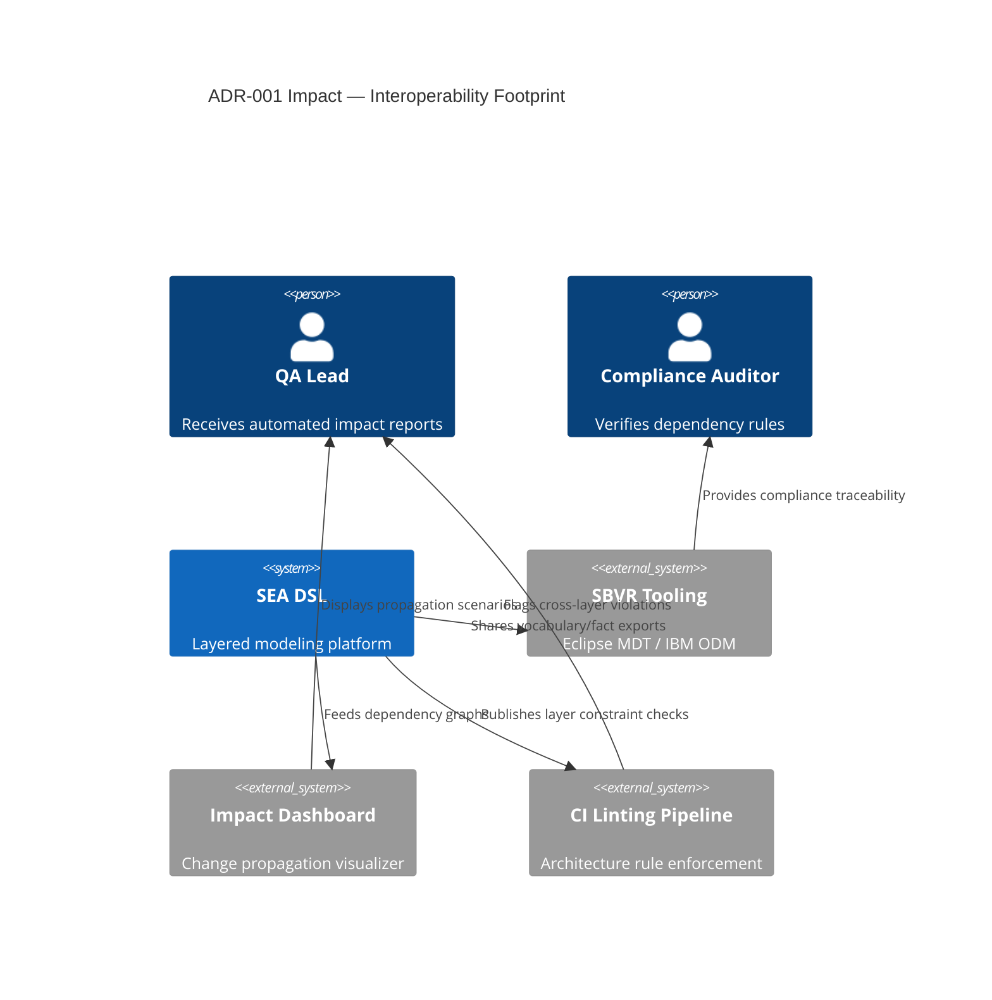

# ADR-001 — Impacted Ecosystem Context

This context view highlights systems and stakeholders affected by the layered architecture decision.

- Related: [Impact propagation flow](ADR-001-flow-impact-propagation.md)
