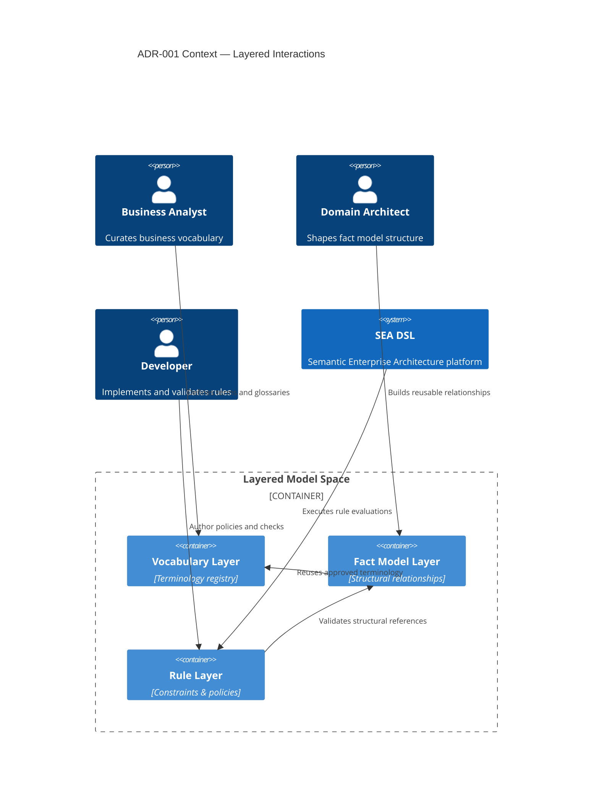

# ADR-001 — Context Layered Boundaries

This diagram highlights how core stakeholders interact with the SEA DSL layers defined in ADR-001.

- Related: [Decision evaluation flow](ADR-001-flow-rationale-evaluation.md)
