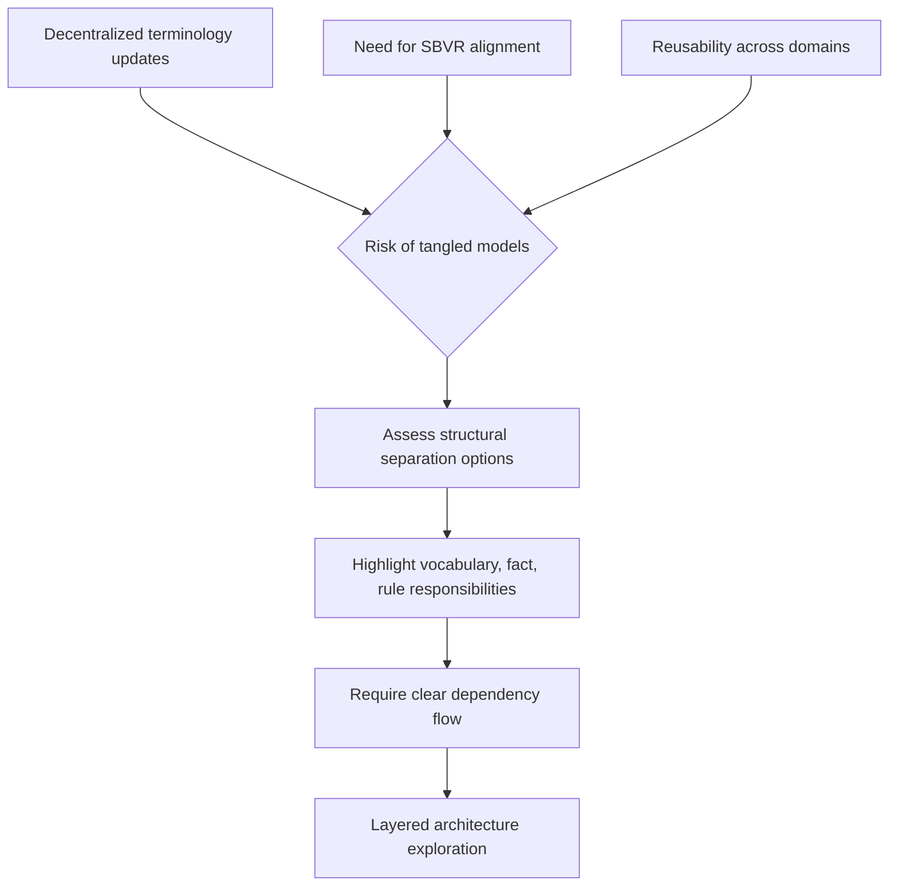

# ADR-001 — Context Decision Pressures

The flowchart traces the forces identified in ADR-001 that culminate in choosing a layered architecture.

- Related: [Architecture options map](ADR-001-container-architecture-options.md)
