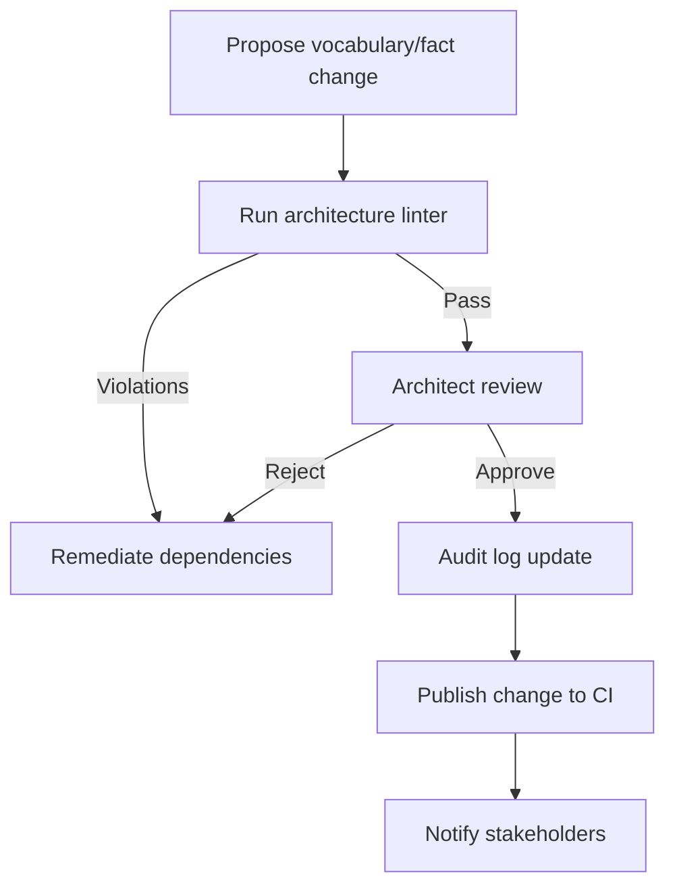

# ADR-001 — Governance Controls Flow

The governance workflow enforces reviews and audit logging for layered architecture decisions.

- Related: [Impact ecosystem context](ADR-001-context-impact-ecosystem.md)
