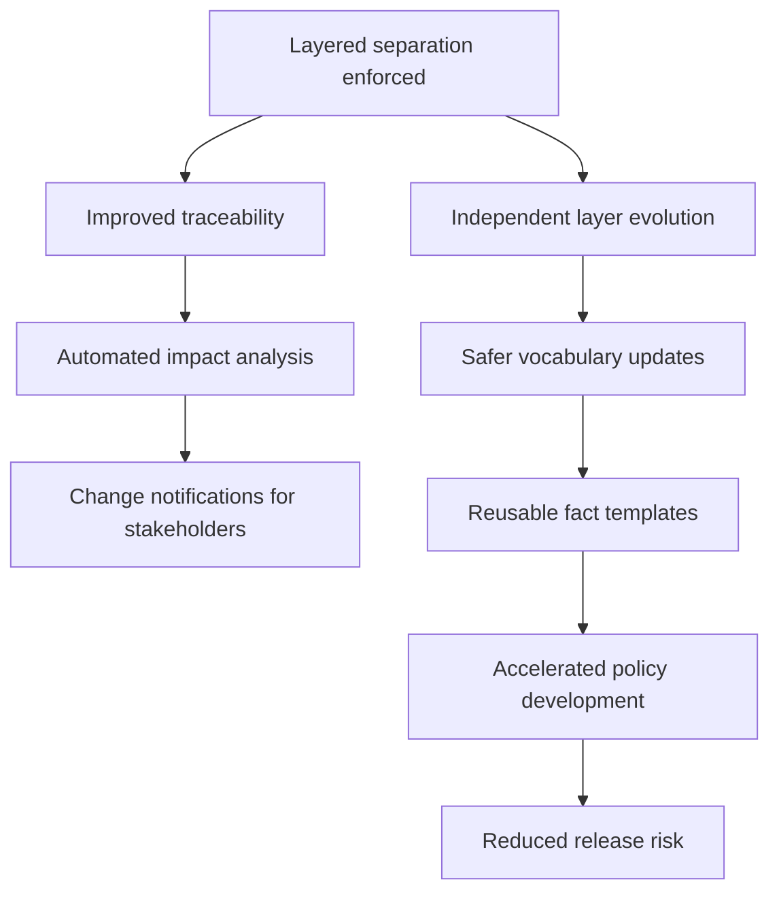

# ADR-001 — Impact Propagation Flow

The flowchart clarifies how the layered architecture influences downstream capabilities.

```mermaid
%% Source: ADR-001 - Layered Architecture: Vocabulary, Facts, Rules
%% Generated: 2025-11-01
%% Section: Impact
%% Diagram: Flowchart
graph TD
  A[Layered separation enforced] --> B[Improved traceability]
  A --> C[Independent layer evolution]
  B --> D[Automated impact analysis]
  D --> E[Change notifications for stakeholders]
  C --> F[Safer vocabulary updates]
  F --> G[Reusable fact templates]
  G --> H[Accelerated policy development]
  H --> I[Reduced release risk]
```

- Related: [Ecosystem context](ADR-001-context-impact-ecosystem.md)
