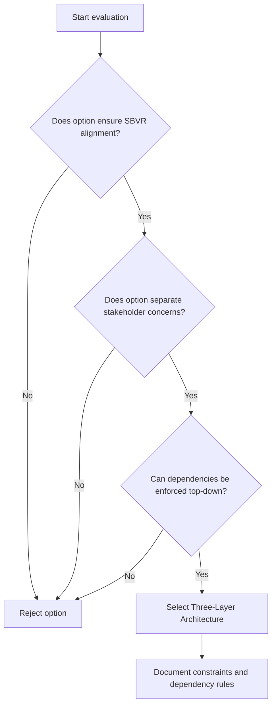

# ADR-001 — Decision Evaluation Flow

The flowchart visualizes how forces and evaluation criteria direct the decision toward the three-layer architecture.

- Related: [Component responsibilities](ADR-001-component-layer-responsibilities.md)
