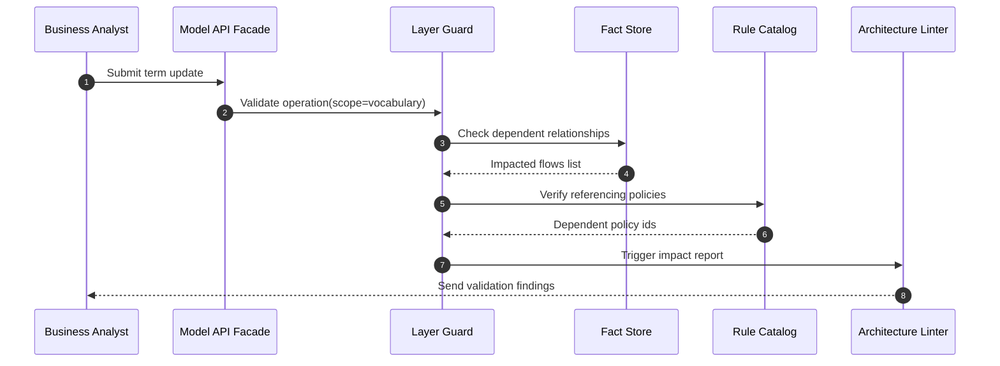

# ADR-001 — Rule Validation Sequence

Sequence illustrates how a vocabulary change triggers validations across layers.

- Related: [Layer dependency enforcement](ADR-001-component-layer-dependencies.md)
