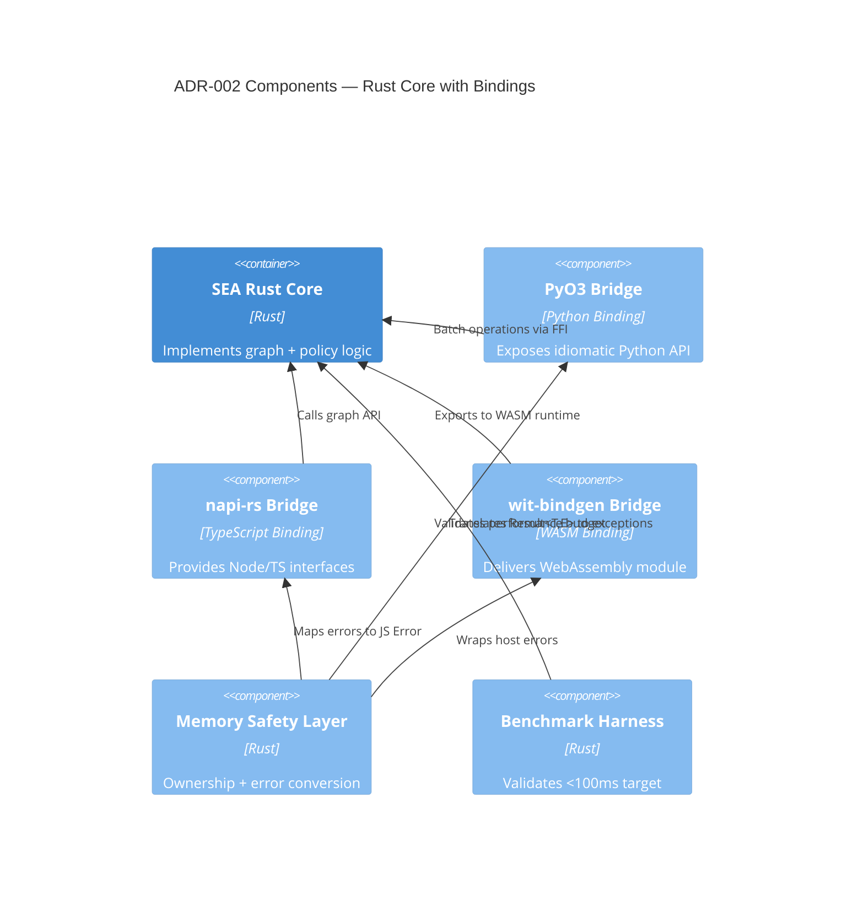

# ADR-002 — Chosen Runtime Components

Component view showing how the Rust core and bindings collaborate to satisfy decision criteria.

- Related: [FFI pipeline implementation](ADR-002-component-ffi-pipeline.md)
