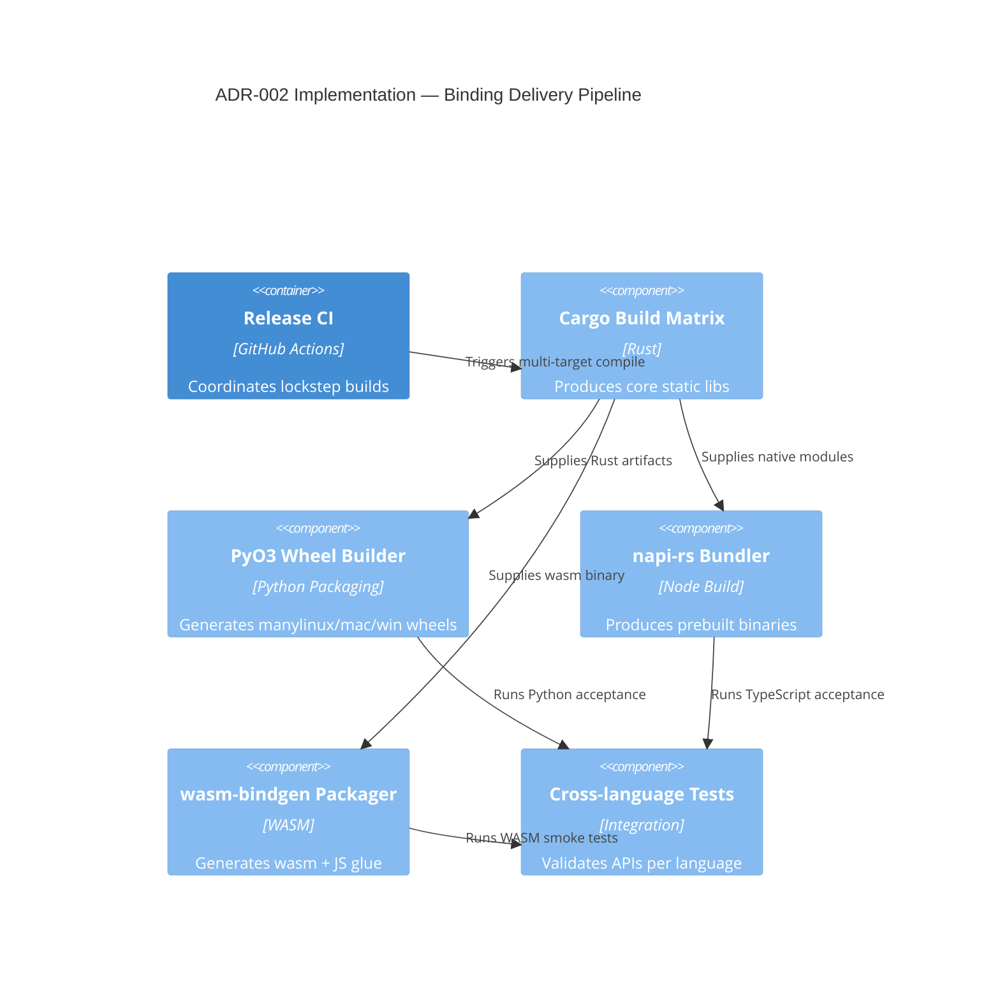

# ADR-002 — FFI Build Pipeline Components

Implementation view of how artifacts are built and validated across target languages.

```mermaid
%% Source: ADR-002 - Rust Core with Multi-Language FFI Bindings
%% Generated: 2025-11-01
%% Section: Implementation
%% Diagram: C4Component
%% !include https://raw.githubusercontent.com/plantuml-stdlib/C4-PlantUML/main/C4_Component.puml
C4Component
  title ADR-002 Implementation — Binding Delivery Pipeline
  Container(ciSystem, "Release CI", "GitHub Actions", "Coordinates lockstep builds")
  Component(cargoBuild, "Cargo Build Matrix", "Rust", "Produces core static libs")
  Component(pyWheel, "PyO3 Wheel Builder", "Python Packaging", "Generates manylinux/mac/win wheels")
  Component(tsNapi, "napi-rs Bundler", "Node Build", "Produces prebuilt binaries")
  Component(wasmPack, "wasm-bindgen Packager", "WASM", "Generates wasm + JS glue")
  Component(testSuite, "Cross-language Tests", "Integration", "Validates APIs per language")
  Rel(ciSystem, cargoBuild, "Triggers multi-target compile")
  Rel(cargoBuild, pyWheel, "Supplies Rust artifacts")
  Rel(cargoBuild, tsNapi, "Supplies native modules")
  Rel(cargoBuild, wasmPack, "Supplies wasm binary")
  Rel(pyWheel, testSuite, "Runs Python acceptance")
  Rel(tsNapi, testSuite, "Runs TypeScript acceptance")
  Rel(wasmPack, testSuite, "Runs WASM smoke tests")
```

- Related: [FFI call sequence](ADR-002-sequence-python-call.md)
