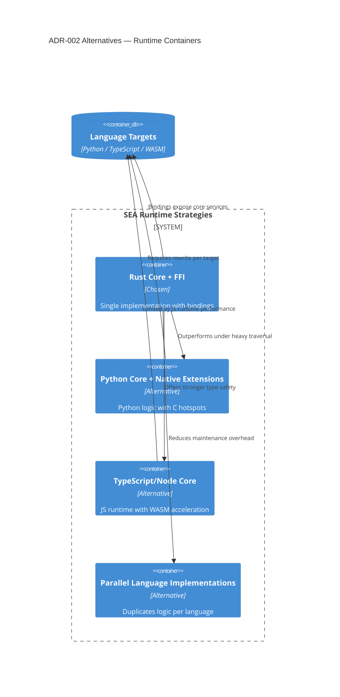

# ADR-002 — Runtime Architecture Options

Container view comparing evaluated runtime strategies before selecting the Rust core.

- Related: [Decision trade-off flow](ADR-002-flow-decision-tradeoffs.md)
