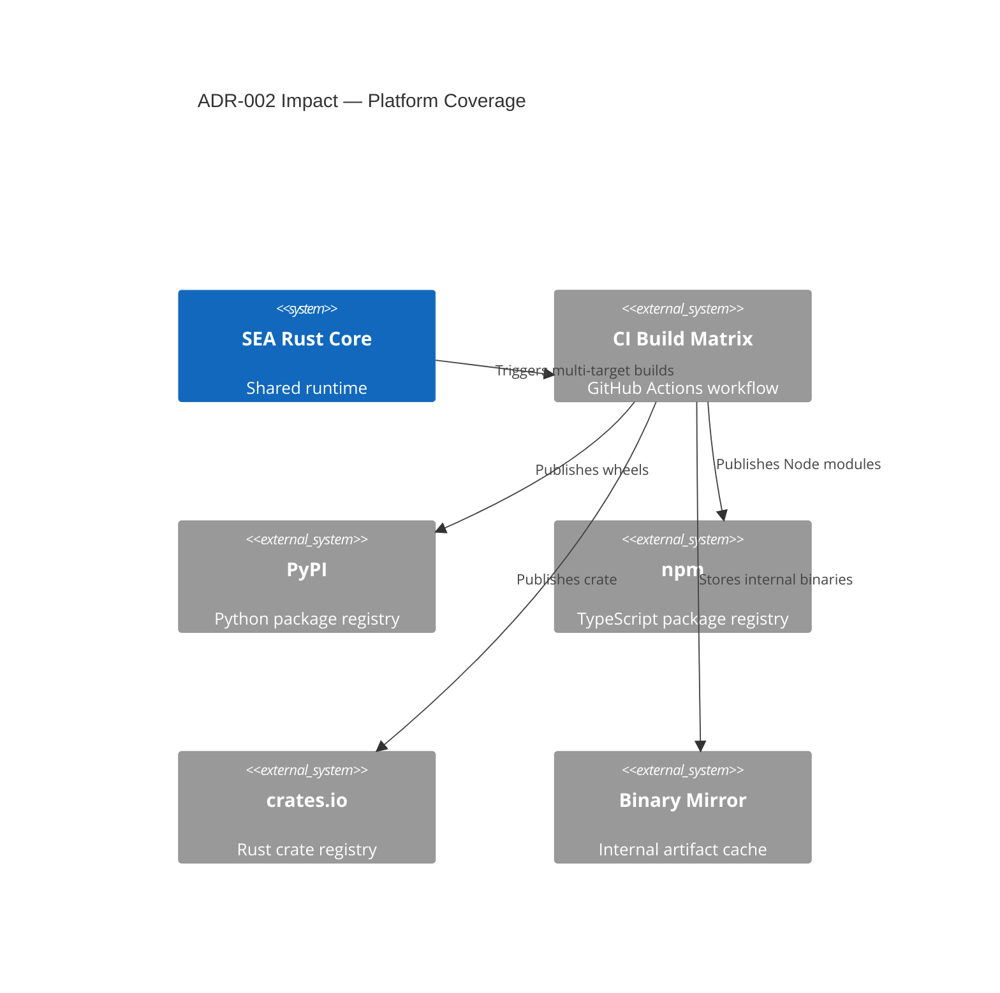

# ADR-002 — Platform Impact Context

Context view of the platform ecosystem affected by the Rust core decision.

```mermaid
%% Source: ADR-002 - Rust Core with Multi-Language FFI Bindings
%% Generated: 2025-11-01
%% Section: Impact
%% Diagram: C4Context
%% !include https://raw.githubusercontent.com/plantuml-stdlib/C4-PlantUML/main/C4_Context.puml
C4Context
  title ADR-002 Impact — Platform Coverage
  System(seaCore, "SEA Rust Core", "Shared runtime")
  System_Ext(ciMatrix, "CI Build Matrix", "GitHub Actions workflow")
  System_Ext(pyRegistry, "PyPI", "Python package registry")
  System_Ext(npmRegistry, "npm", "TypeScript package registry")
  System_Ext(crateRegistry, "crates.io", "Rust crate registry")
  System_Ext(artifactMirror, "Binary Mirror", "Internal artifact cache")
  Rel(seaCore, ciMatrix, "Triggers multi-target builds")
  Rel(ciMatrix, pyRegistry, "Publishes wheels")
  Rel(ciMatrix, npmRegistry, "Publishes Node modules")
  Rel(ciMatrix, crateRegistry, "Publishes crate")
  Rel(ciMatrix, artifactMirror, "Stores internal binaries")
```

- Related: [Impact flow](ADR-002-flow-impact-surface.md)
