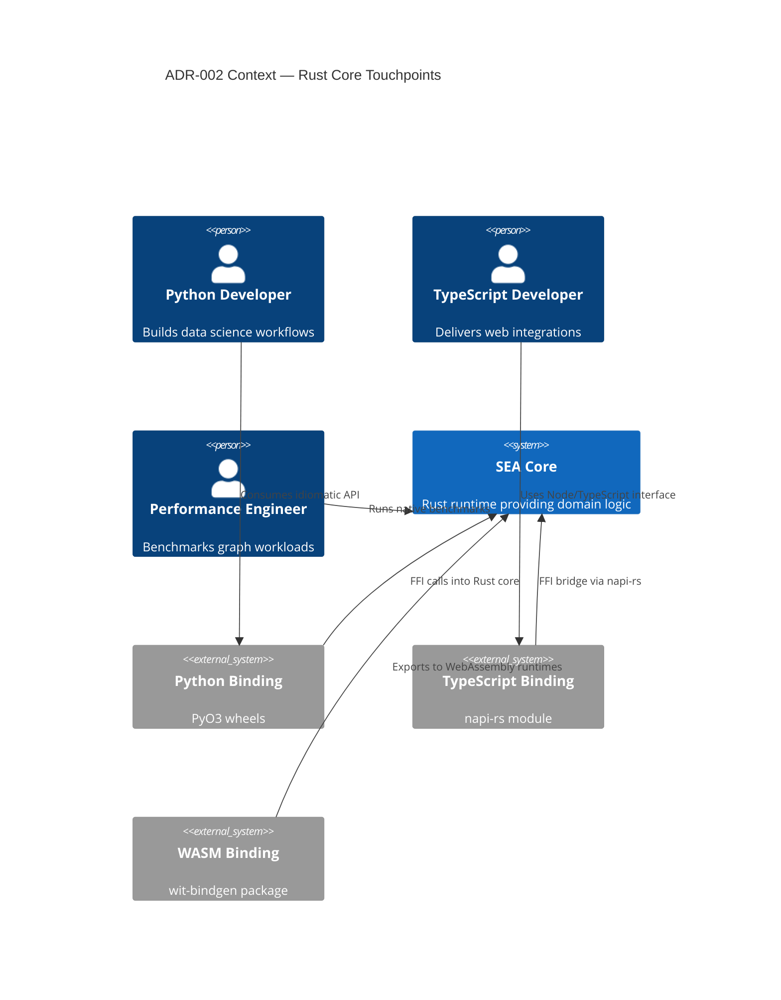

# ADR-002 — Multilanguage Ecosystem Context

Context view depicting how stakeholders interface with the Rust core and bindings defined in ADR-002.

- Related: [Context forces flow](ADR-002-flow-context-forces.md)
