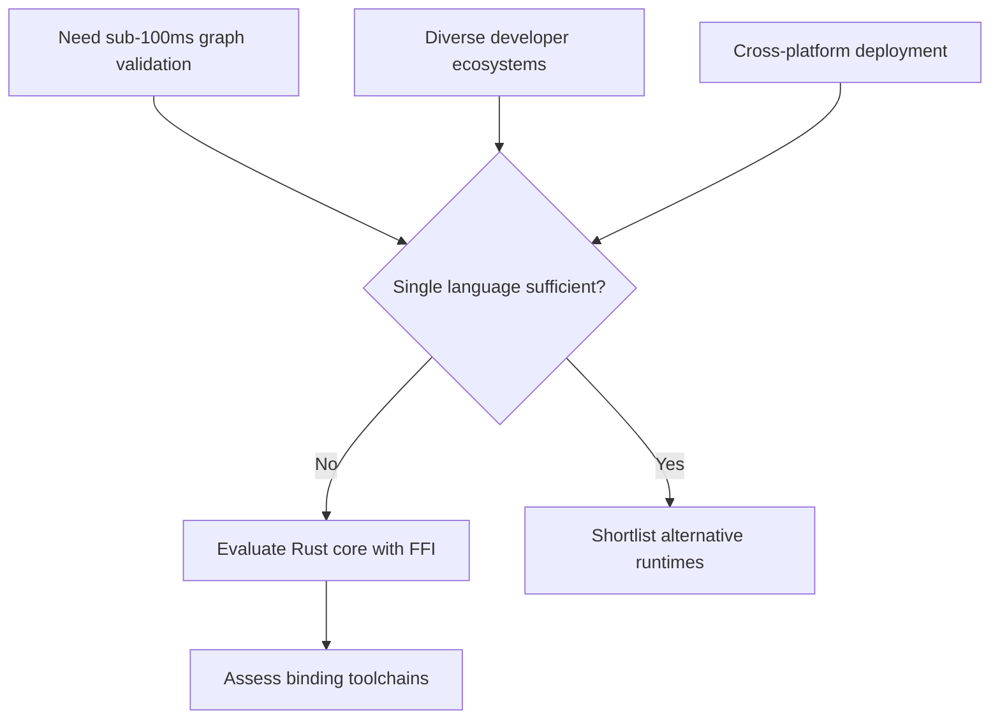

# ADR-002 — Context Forces Flow

The flowchart outlines performance and accessibility pressures leading to the multi-language requirement.

- Related: [Alternative runtime options](ADR-002-container-runtime-options.md)
