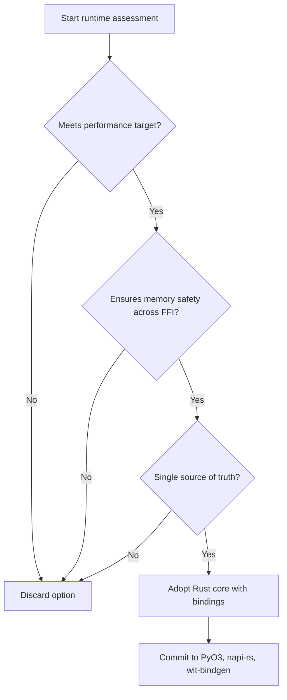

# ADR-002 — Decision Trade-offs Flow

The flow reveals how evaluation criteria eliminate alternatives and confirm the Rust core.

- Related: [Chosen runtime component view](ADR-002-component-chosen-architecture.md)
