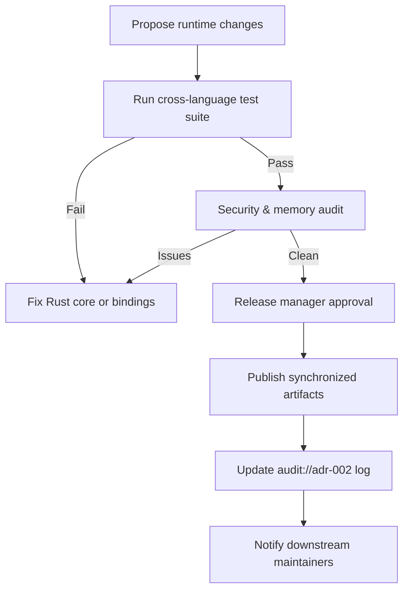

# ADR-002 — Release Governance Flow

Governance workflow ensuring safe releases for the Rust core and bindings.

```mermaid
%% Source: ADR-002 - Rust Core with Multi-Language FFI Bindings
%% Generated: 2025-11-01
%% Section: Governance
%% Diagram: Flowchart
graph TD
  A[Propose runtime changes] --> B[Run cross-language test suite]
  B -->|Fail| C[Fix Rust core or bindings]
  B -->|Pass| D[Security & memory audit]
  D -->|Issues| C
  D -->|Clean| E[Release manager approval]
  E --> F[Publish synchronized artifacts]
  F --> G[Update audit://adr-002 log]
  G --> H[Notify downstream maintainers]
```

- Related: [Platform impact context](ADR-002-context-impact-platforms.md)
