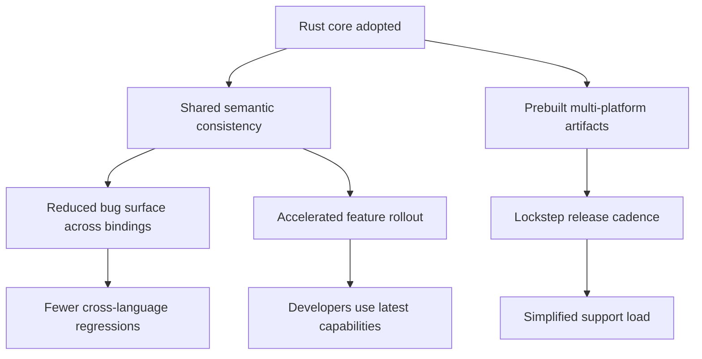

# ADR-002 — Impact Surface Flow

Flowchart highlights the downstream effects of consolidating on a Rust core with FFI bindings.

- Related: [Platform impact context](ADR-002-context-impact-platforms.md)
