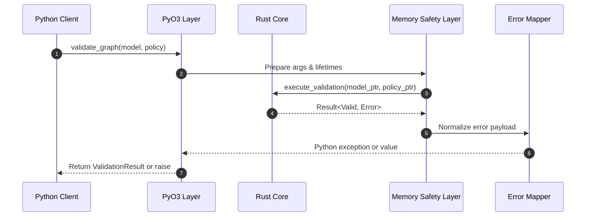

# ADR-002 — Python Binding Call Sequence

Sequence demonstrates how a Python client invocation propagates through the FFI boundary.

- Related: [Binding pipeline components](ADR-002-component-ffi-pipeline.md)
