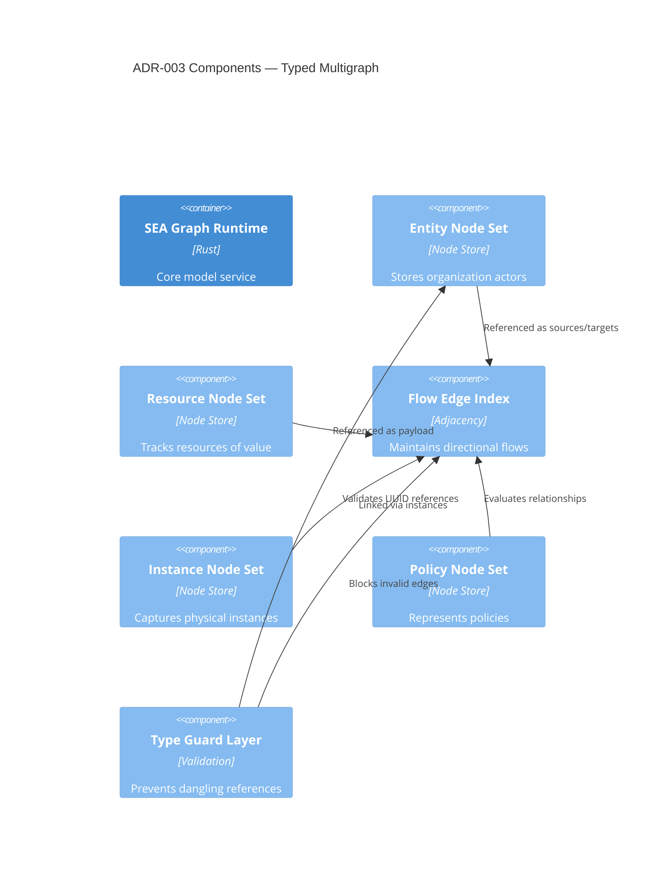

# ADR-003 — Graph Architecture Components

Component view of the selected typed multigraph representation.

```mermaid
%% Source: ADR-003 - Graph-Based Domain Model Representation
%% Generated: 2025-11-01
%% Section: Decision
%% Diagram: C4Component
%% !include https://raw.githubusercontent.com/plantuml-stdlib/C4-PlantUML/main/C4_Component.puml
C4Component
  title ADR-003 Components — Typed Multigraph
  Container(seaGraph, "SEA Graph Runtime", "Rust", "Core model service")
  Component(entitySet, "Entity Node Set", "Node Store", "Stores organization actors")
  Component(resourceSet, "Resource Node Set", "Node Store", "Tracks resources of value")
  Component(flowEdges, "Flow Edge Index", "Adjacency", "Maintains directional flows")
  Component(instanceSet, "Instance Node Set", "Node Store", "Captures physical instances")
  Component(policyNodes, "Policy Node Set", "Node Store", "Represents policies")
  Component(typeGuard, "Type Guard Layer", "Validation", "Prevents dangling references")
  Rel(entitySet, flowEdges, "Referenced as sources/targets")
  Rel(resourceSet, flowEdges, "Referenced as payload")
  Rel(instanceSet, flowEdges, "Linked via instances")
  Rel(policyNodes, flowEdges, "Evaluates relationships")
  Rel(typeGuard, entitySet, "Validates UUID references")
  Rel(typeGuard, flowEdges, "Blocks invalid edges")
```

- Related: [Storage indexes implementation](ADR-003-component-storage-indexes.md)
