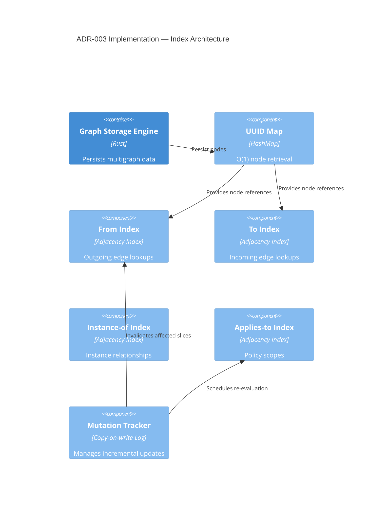

# ADR-003 — Storage Index Components

Implementation components ensuring traversal and lookup performance.

```mermaid
%% Source: ADR-003 - Graph-Based Domain Model Representation
%% Generated: 2025-11-01
%% Section: Implementation
%% Diagram: C4Component
%% !include https://raw.githubusercontent.com/plantuml-stdlib/C4-PlantUML/main/C4_Component.puml
C4Component
  title ADR-003 Implementation — Index Architecture
  Container(storageEngine, "Graph Storage Engine", "Rust", "Persists multigraph data")
  Component(uuidMap, "UUID Map", "HashMap", "O(1) node retrieval")
  Component(fromIndex, "From Index", "Adjacency Index", "Outgoing edge lookups")
  Component(toIndex, "To Index", "Adjacency Index", "Incoming edge lookups")
  Component(instanceIndex, "Instance-of Index", "Adjacency Index", "Instance relationships")
  Component(policyIndex, "Applies-to Index", "Adjacency Index", "Policy scopes")
  Component(changeTracker, "Mutation Tracker", "Copy-on-write Log", "Manages incremental updates")
  Rel(storageEngine, uuidMap, "Persist nodes")
  Rel(uuidMap, fromIndex, "Provides node references")
  Rel(uuidMap, toIndex, "Provides node references")
  Rel(changeTracker, fromIndex, "Invalidates affected slices")
  Rel(changeTracker, policyIndex, "Schedules re-evaluation")
```

- Related: [Traversal validation sequence](ADR-003-sequence-traversal-validation.md)
