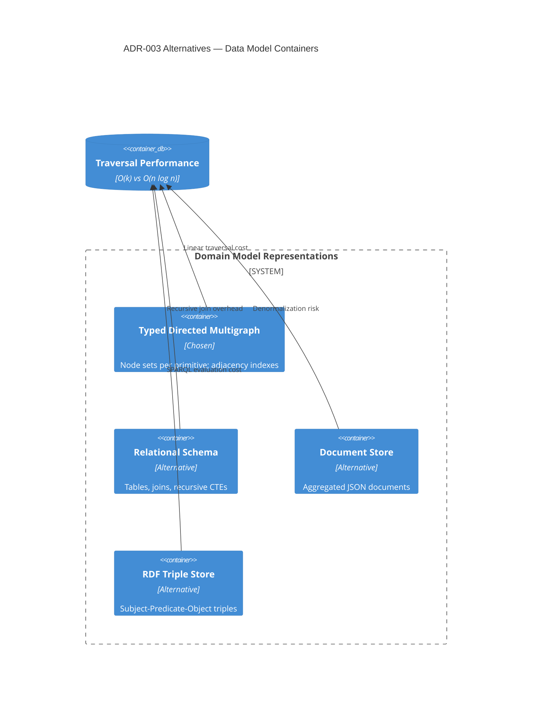

# ADR-003 — Model Representation Options

Container diagram comparing candidate data representations.

```mermaid
%% Source: ADR-003 - Graph-Based Domain Model Representation
%% Generated: 2025-11-01
%% Section: Alternatives
%% Diagram: C4Container
%% !include https://raw.githubusercontent.com/plantuml-stdlib/C4-PlantUML/main/C4_Container.puml
C4Container
  title ADR-003 Alternatives — Data Model Containers
  System_Boundary(models, "Domain Model Representations") {
    Container(graphModel, "Typed Directed Multigraph", "Chosen", "Node sets per primitive; adjacency indexes")
    Container(relationalModel, "Relational Schema", "Alternative", "Tables, joins, recursive CTEs")
    Container(documentModel, "Document Store", "Alternative", "Aggregated JSON documents")
    Container(rdfModel, "RDF Triple Store", "Alternative", "Subject-Predicate-Object triples")
  }
  ContainerDb(perfMetric, "Traversal Performance", "O(k) vs O(n log n)")
  Rel(graphModel, perfMetric, "Linear traversal cost")
  Rel(relationalModel, perfMetric, "Recursive join overhead")
  Rel(documentModel, perfMetric, "Denormalization risk")
  Rel(rdfModel, perfMetric, "SPARQL evaluation cost")
```

- Related: [Decision evaluation flow](ADR-003-flow-decision-evaluation.md)
