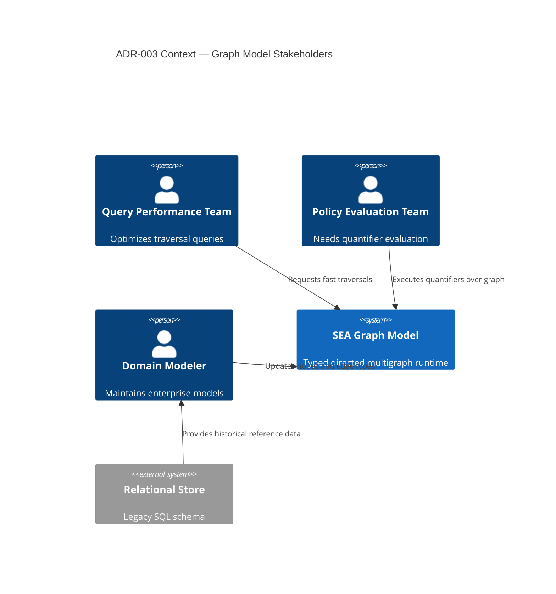

# ADR-003 — Graph Modeling Context

Context diagram showing stakeholders demanding graph traversal capabilities.

```mermaid
%% Source: ADR-003 - Graph-Based Domain Model Representation
%% Generated: 2025-11-01
%% Section: Context
%% Diagram: C4Context
%% !include https://raw.githubusercontent.com/plantuml-stdlib/C4-PlantUML/main/C4_Context.puml
C4Context
  title ADR-003 Context — Graph Model Stakeholders
  Person(queryTeam, "Query Performance Team", "Optimizes traversal queries")
  Person(policyTeam, "Policy Evaluation Team", "Needs quantifier evaluation")
  Person(modeler, "Domain Modeler", "Maintains enterprise models")
  System(seaGraph, "SEA Graph Model", "Typed directed multigraph runtime")
  System_Ext(relationalDb, "Relational Store", "Legacy SQL schema")
  Rel(queryTeam, seaGraph, "Requests fast traversals")
  Rel(policyTeam, seaGraph, "Executes quantifiers over graph")
  Rel(modeler, seaGraph, "Updates nodes and edge types")
  Rel(relationalDb, modeler, "Provides historical reference data")
```

- Related: [Context pressure flow](ADR-003-flow-context-pressures.md)
