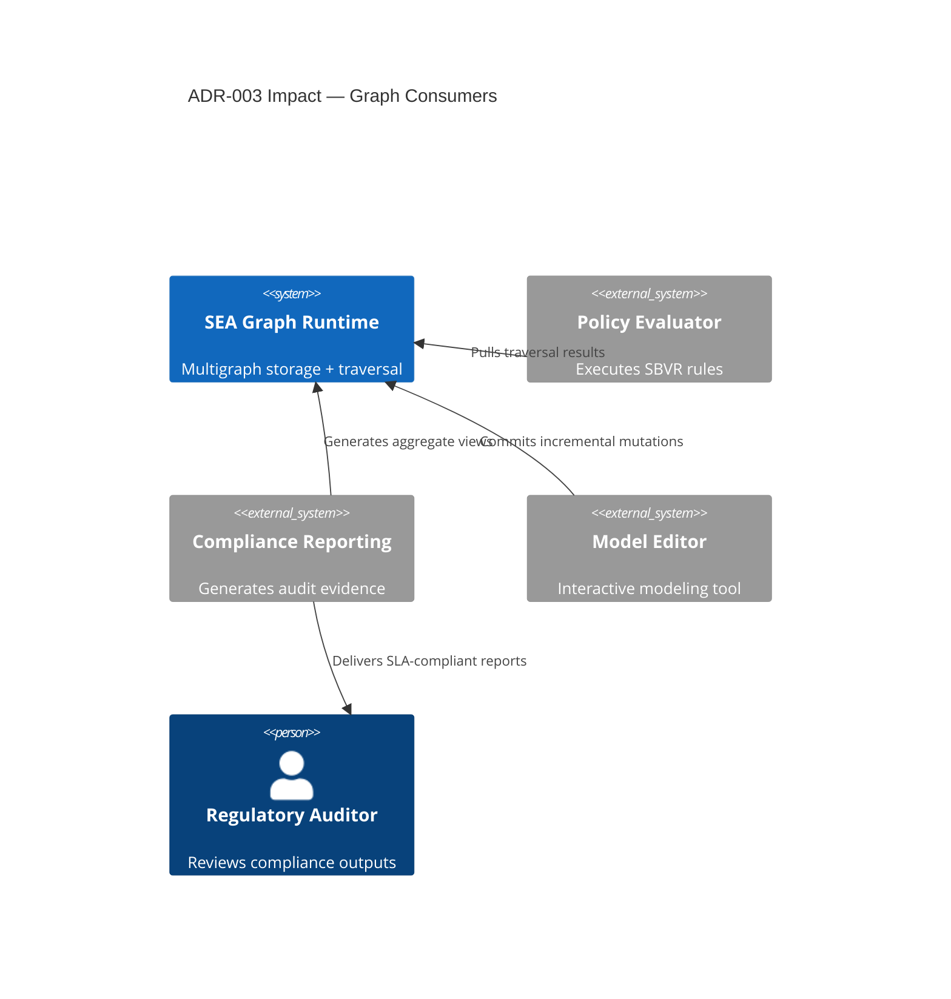

# ADR-003 — Impacted Systems Context

Context diagram of systems benefiting from the graph-based model.

```mermaid
%% Source: ADR-003 - Graph-Based Domain Model Representation
%% Generated: 2025-11-01
%% Section: Impact
%% Diagram: C4Context
%% !include https://raw.githubusercontent.com/plantuml-stdlib/C4-PlantUML/main/C4_Context.puml
C4Context
  title ADR-003 Impact — Graph Consumers
  System(seaGraph, "SEA Graph Runtime", "Multigraph storage + traversal")
  System_Ext(policyEngine, "Policy Evaluator", "Executes SBVR rules")
  System_Ext(reporting, "Compliance Reporting", "Generates audit evidence")
  System_Ext(modelEditor, "Model Editor", "Interactive modeling tool")
  Person(auditor, "Regulatory Auditor", "Reviews compliance outputs")
  Rel(policyEngine, seaGraph, "Pulls traversal results")
  Rel(reporting, seaGraph, "Generates aggregate views")
  Rel(modelEditor, seaGraph, "Commits incremental mutations")
  Rel(reporting, auditor, "Delivers SLA-compliant reports")
```

- Related: [Performance impact flow](ADR-003-flow-impact-performance.md)
