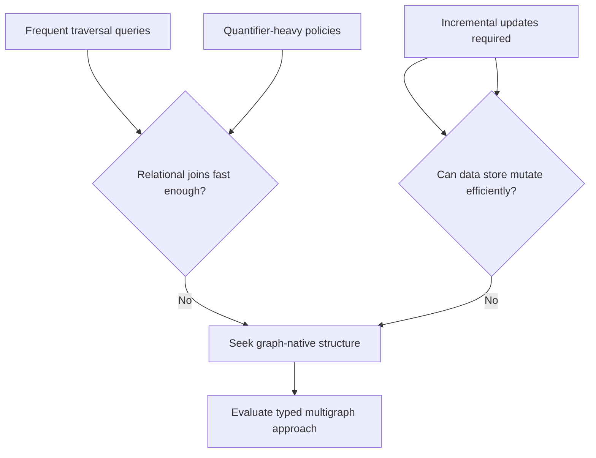

# ADR-003 — Context Pressure Flow

Flowchart summarizing operational forces that motivated a graph-based model.

```mermaid
%% Source: ADR-003 - Graph-Based Domain Model Representation
%% Generated: 2025-11-01
%% Section: Context
%% Diagram: Flowchart
graph TD
  A[Frequent traversal queries] --> B{Relational joins fast enough?}
  C[Quantifier-heavy policies] --> B
  D[Incremental updates required] --> E{Can data store mutate efficiently?}
  B -->|No| F[Seek graph-native structure]
  E -->|No| F
  D --> E
  F --> G[Evaluate typed multigraph approach]
```

- Related: [Model options comparison](ADR-003-container-model-options.md)
