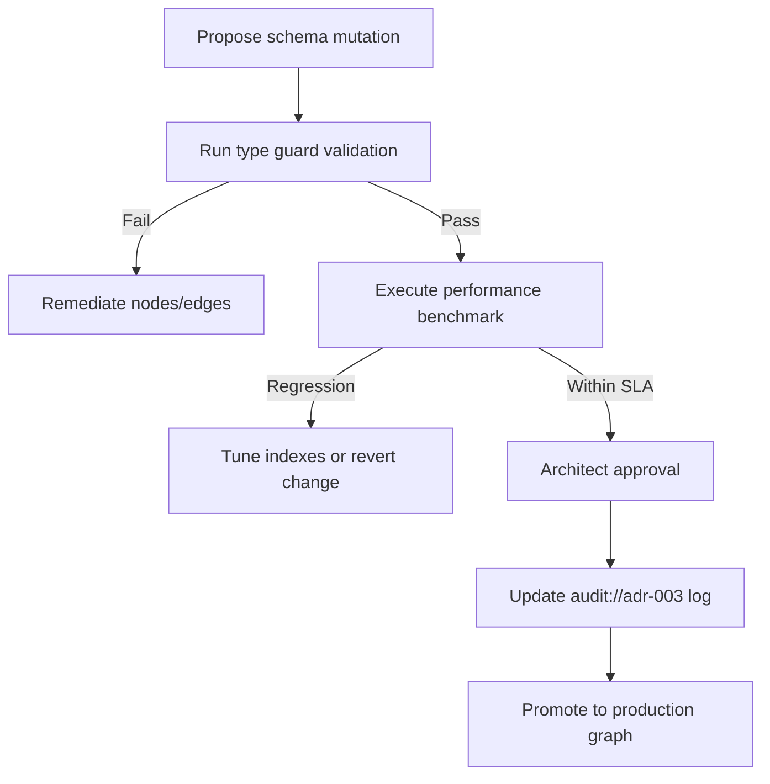

# ADR-003 — Graph Governance Flow

Workflow governing quality controls for the graph representation.

```mermaid
%% Source: ADR-003 - Graph-Based Domain Model Representation
%% Generated: 2025-11-01
%% Section: Governance
%% Diagram: Flowchart
graph TD
  A[Propose schema mutation] --> B[Run type guard validation]
  B -->|Fail| C[Remediate nodes/edges]
  B -->|Pass| D[Execute performance benchmark]
  D -->|Regression| E[Tune indexes or revert change]
  D -->|Within SLA| F[Architect approval]
  F --> G[Update audit://adr-003 log]
  G --> H[Promote to production graph]
```

- Related: [Storage index components](ADR-003-component-storage-indexes.md)
