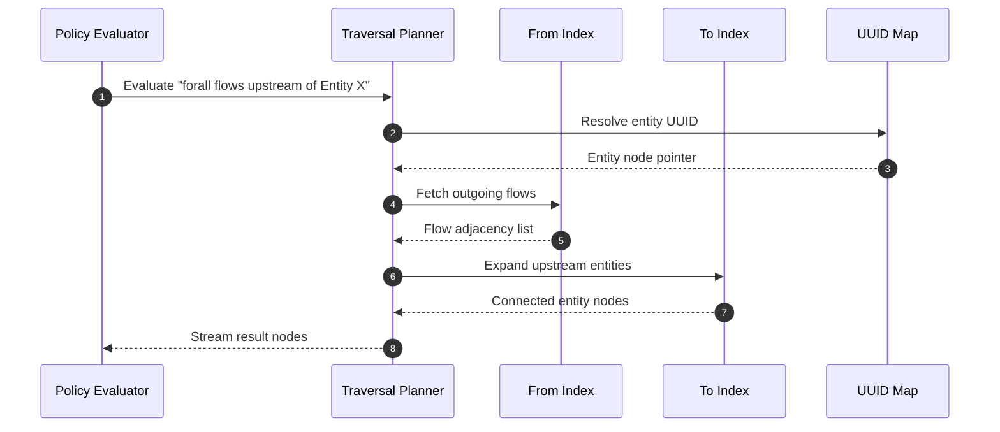

# ADR-003 — Traversal Validation Sequence

Sequence exposes how traversal queries execute over adjacency indexes.

```mermaid
%% Source: ADR-003 - Graph-Based Domain Model Representation
%% Generated: 2025-11-01
%% Section: Implementation
%% Diagram: sequenceDiagram
sequenceDiagram
  %% !include https://raw.githubusercontent.com/plantuml-stdlib/C4-PlantUML/main/C4_Dynamic.puml
  autonumber
  participant PolicyEngine as Policy Evaluator
  participant Traversal as Traversal Planner
  participant FromIdx as From Index
  participant ToIdx as To Index
  participant UUIDMap as UUID Map
  PolicyEngine->>Traversal: Evaluate "forall flows upstream of Entity X"
  Traversal->>UUIDMap: Resolve entity UUID
  UUIDMap-->>Traversal: Entity node pointer
  Traversal->>FromIdx: Fetch outgoing flows
  FromIdx-->>Traversal: Flow adjacency list
  Traversal->>ToIdx: Expand upstream entities
  ToIdx-->>Traversal: Connected entity nodes
  Traversal-->>PolicyEngine: Stream result nodes
```

- Related: [Storage index components](ADR-003-component-storage-indexes.md)
