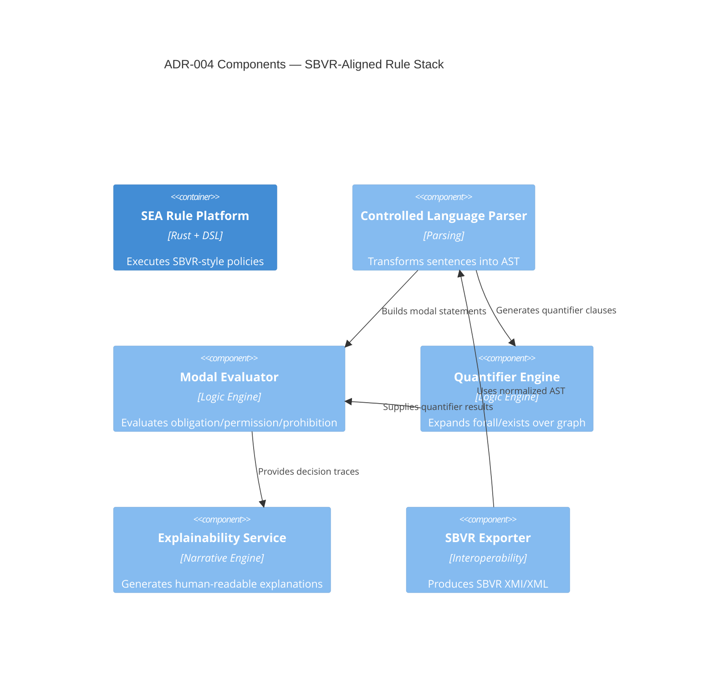

# ADR-004 — Rule Architecture Components

Component view outlining how the SBVR-aligned language satisfies decision goals.

- Related: [Rule pipeline implementation](ADR-004-component-rule-pipeline.md)
