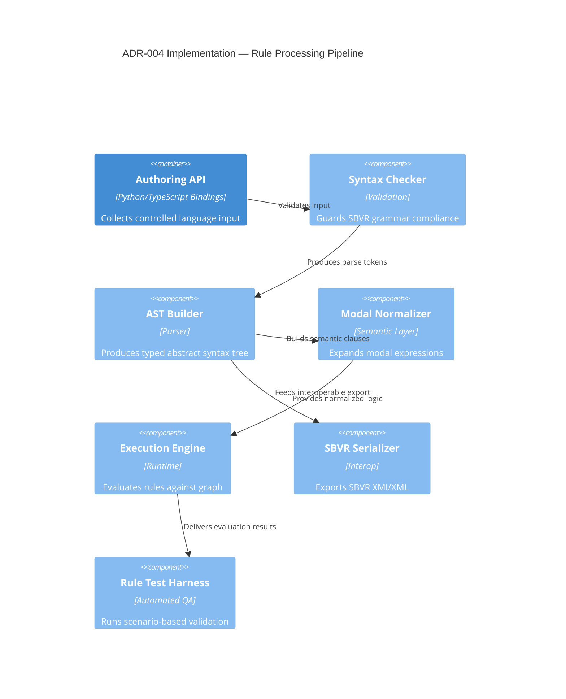

# ADR-004 — Rule Pipeline Components

Implementation components enforcing semantics and interoperability for SBVR-aligned rules.

- Related: [Rule evaluation sequence](ADR-004-sequence-rule-evaluation.md)
