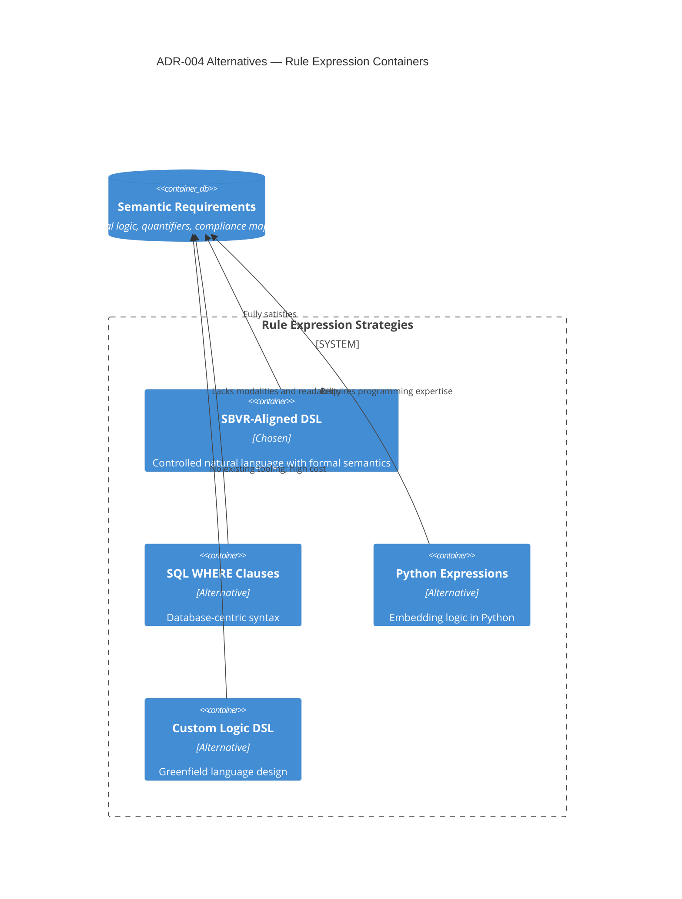

# ADR-004 — Rule Language Options

Container diagram comparing candidate rule languages against required capabilities.

```mermaid
%% Source: ADR-004 - SBVR-Aligned Rule Expression Language
%% Generated: 2025-11-01
%% Section: Alternatives
%% Diagram: C4Container
%% !include https://raw.githubusercontent.com/plantuml-stdlib/C4-PlantUML/main/C4_Container.puml
C4Container
  title ADR-004 Alternatives — Rule Expression Containers
  System_Boundary(options, "Rule Expression Strategies") {
    Container(sbvrDsl, "SBVR-Aligned DSL", "Chosen", "Controlled natural language with formal semantics")
    Container(sqlWhere, "SQL WHERE Clauses", "Alternative", "Database-centric syntax")
    Container(pythonDsl, "Python Expressions", "Alternative", "Embedding logic in Python")
    Container(customDsl, "Custom Logic DSL", "Alternative", "Greenfield language design")
  }
  ContainerDb(requirements, "Semantic Requirements", "Modal logic, quantifiers, compliance mapping")
  Rel(sbvrDsl, requirements, "Fully satisfies")
  Rel(sqlWhere, requirements, "Lacks modalities and readability")
  Rel(pythonDsl, requirements, "Requires programming expertise")
  Rel(customDsl, requirements, "No existing tooling; high cost")
```

- Related: [Decision justification flow](ADR-004-flow-decision-logic.md)
