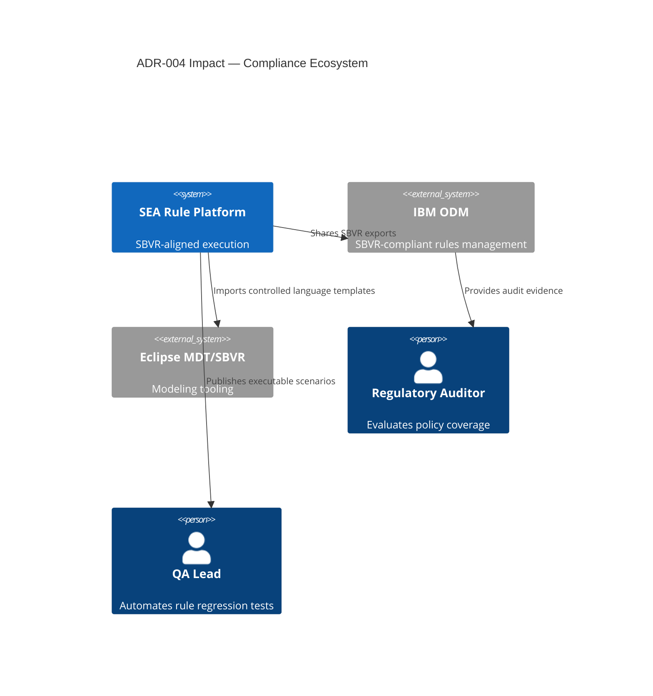

# ADR-004 — Compliance Impact Context

Context view of compliance ecosystems leveraging the SBVR-aligned language.

```mermaid
%% Source: ADR-004 - SBVR-Aligned Rule Expression Language
%% Generated: 2025-11-01
%% Section: Impact
%% Diagram: C4Context
%% !include https://raw.githubusercontent.com/plantuml-stdlib/C4-PlantUML/main/C4_Context.puml
C4Context
  title ADR-004 Impact — Compliance Ecosystem
  System(seaRules, "SEA Rule Platform", "SBVR-aligned execution")
  System_Ext(ibmOdm, "IBM ODM", "SBVR-compliant rules management")
  System_Ext(eclipseMdt, "Eclipse MDT/SBVR", "Modeling tooling")
  Person(regAuditor, "Regulatory Auditor", "Evaluates policy coverage")
  Person(qaLead, "QA Lead", "Automates rule regression tests")
  Rel(seaRules, ibmOdm, "Shares SBVR exports")
  Rel(seaRules, eclipseMdt, "Imports controlled language templates")
  Rel(ibmOdm, regAuditor, "Provides audit evidence")
  Rel(seaRules, qaLead, "Publishes executable scenarios")
```

- Related: [Adoption impact flow](ADR-004-flow-impact-adoption.md)
