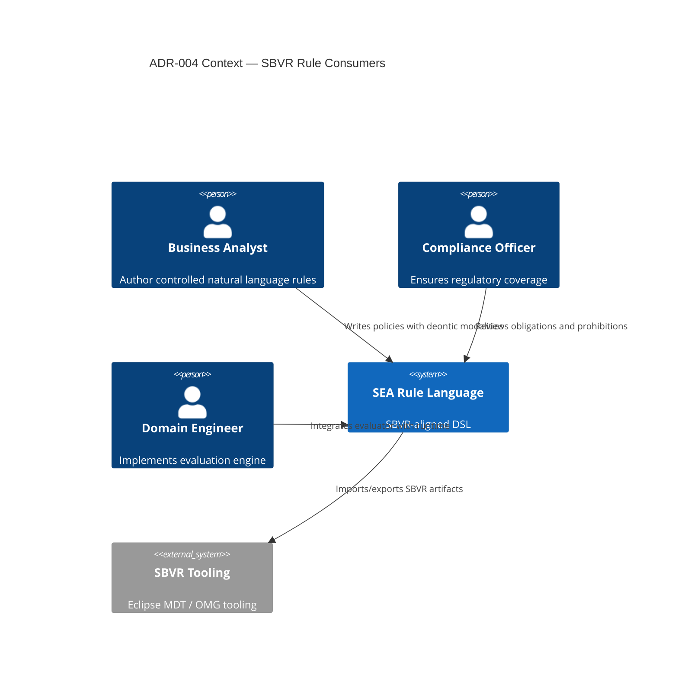

# ADR-004 — Rule Semantics Context

Context diagram showing stakeholders requiring SBVR-aligned rule expressions.

```mermaid
%% Source: ADR-004 - SBVR-Aligned Rule Expression Language
%% Generated: 2025-11-01
%% Section: Context
%% Diagram: C4Context
%% !include https://raw.githubusercontent.com/plantuml-stdlib/C4-PlantUML/main/C4_Context.puml
C4Context
  title ADR-004 Context — SBVR Rule Consumers
  Person(businessAnalyst, "Business Analyst", "Author controlled natural language rules")
  Person(complianceOfficer, "Compliance Officer", "Ensures regulatory coverage")
  Person(engineer, "Domain Engineer", "Implements evaluation engine")
  System(ruleLanguage, "SEA Rule Language", "SBVR-aligned DSL")
  System_Ext(sbvrTool, "SBVR Tooling", "Eclipse MDT / OMG tooling")
  Rel(businessAnalyst, ruleLanguage, "Writes policies with deontic modalities")
  Rel(complianceOfficer, ruleLanguage, "Reviews obligations and prohibitions")
  Rel(engineer, ruleLanguage, "Integrates evaluator with runtime")
  Rel(ruleLanguage, sbvrTool, "Imports/exports SBVR artifacts")
```

- Related: [Context forces flow](ADR-004-flow-context-pressures.md)
