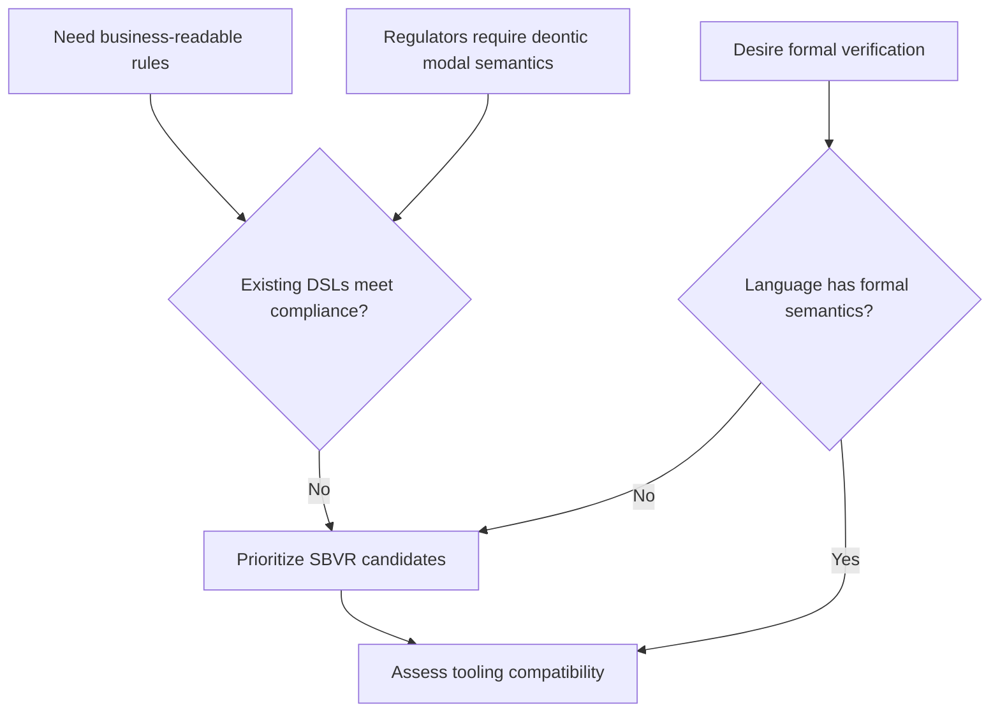

# ADR-004 — Context Pressure Flow

Flowchart illustrates semantic and compliance pressures that required SBVR alignment.

```mermaid
%% Source: ADR-004 - SBVR-Aligned Rule Expression Language
%% Generated: 2025-11-01
%% Section: Context
%% Diagram: Flowchart
graph TD
  A[Need business-readable rules] --> B{Existing DSLs meet compliance?}
  C[Regulators require deontic modal semantics] --> B
  D[Desire formal verification] --> E{Language has formal semantics?}
  B -->|No| F[Prioritize SBVR candidates]
  E -->|No| F
  E -->|Yes| G[Assess tooling compatibility]
  F --> G
```

- Related: [Rule language options](ADR-004-container-rule-options.md)
