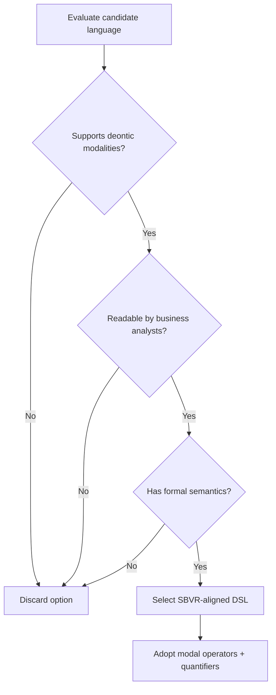

# ADR-004 — Decision Logic Flow

Flowchart demonstrating evaluation of rule language options against decision criteria.

- Related: [Rule engine component view](ADR-004-component-rule-architecture.md)
