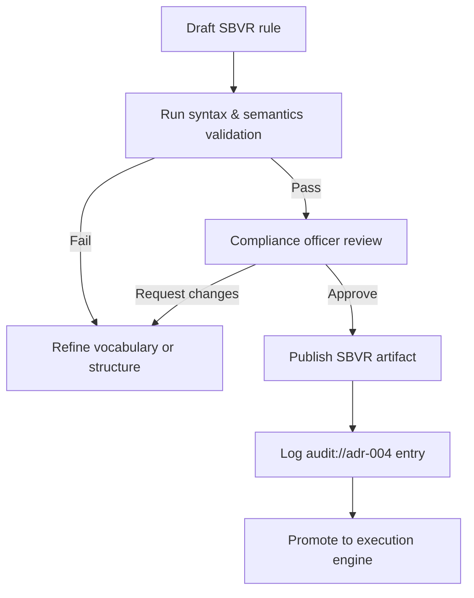

# ADR-004 — Governance Approval Flow

Workflow ensuring SBVR-aligned rules undergo proper validation and audit logging.

```mermaid
%% Source: ADR-004 - SBVR-Aligned Rule Expression Language
%% Generated: 2025-11-01
%% Section: Governance
%% Diagram: Flowchart
graph TD
  A[Draft SBVR rule] --> B[Run syntax & semantics validation]
  B -->|Fail| C[Refine vocabulary or structure]
  B -->|Pass| D[Compliance officer review]
  D -->|Request changes| C
  D -->|Approve| E[Publish SBVR artifact]
  E --> F[Log audit://adr-004 entry]
  F --> G[Promote to execution engine]
```

- Related: [Rule pipeline components](ADR-004-component-rule-pipeline.md)
