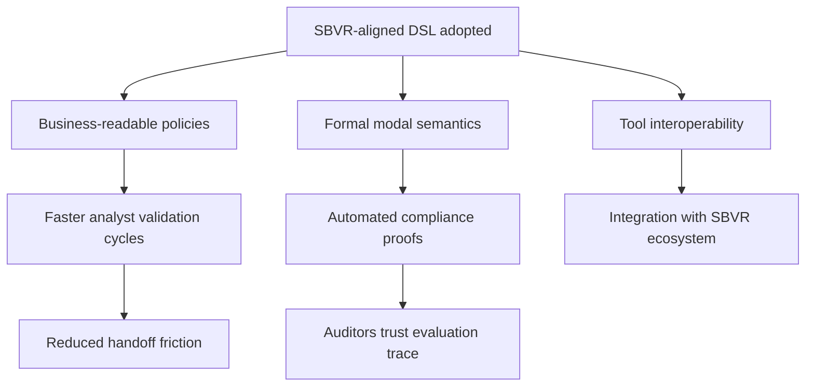

# ADR-004 — Adoption Impact Flow

Flowchart presenting the outcomes delivered by aligning with SBVR.

```mermaid
%% Source: ADR-004 - SBVR-Aligned Rule Expression Language
%% Generated: 2025-11-01
%% Section: Impact
%% Diagram: Flowchart
graph TD
  A[SBVR-aligned DSL adopted] --> B[Business-readable policies]
  A --> C[Formal modal semantics]
  B --> D[Faster analyst validation cycles]
  D --> E[Reduced handoff friction]
  C --> F[Automated compliance proofs]
  F --> G[Auditors trust evaluation trace]
  A --> H[Tool interoperability]
  H --> I[Integration with SBVR ecosystem]
```

- Related: [Compliance context view](ADR-004-context-impact-compliance.md)
