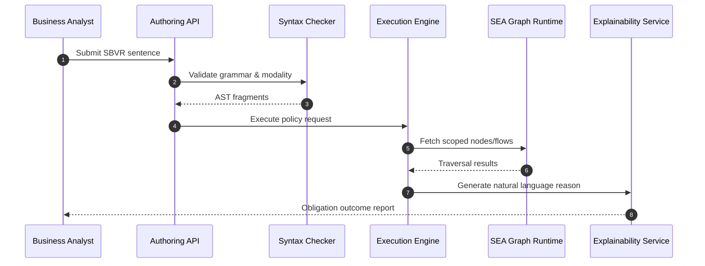

# ADR-004 — Rule Evaluation Sequence

Sequence traces rule authoring through to execution and explanation.

```mermaid
%% Source: ADR-004 - SBVR-Aligned Rule Expression Language
%% Generated: 2025-11-01
%% Section: Implementation
%% Diagram: sequenceDiagram
sequenceDiagram
  %% !include https://raw.githubusercontent.com/plantuml-stdlib/C4-PlantUML/main/C4_Dynamic.puml
  autonumber
  participant Analyst as Business Analyst
  participant AuthorAPI as Authoring API
  participant Syntax as Syntax Checker
  participant Engine as Execution Engine
  participant Graph as SEA Graph Runtime
  participant Explain as Explainability Service
  Analyst->>AuthorAPI: Submit SBVR sentence
  AuthorAPI->>Syntax: Validate grammar & modality
  Syntax-->>AuthorAPI: AST fragments
  AuthorAPI->>Engine: Execute policy request
  Engine->>Graph: Fetch scoped nodes/flows
  Graph-->>Engine: Traversal results
  Engine->>Explain: Generate natural language reason
  Explain-->>Analyst: Obligation outcome report
```

- Related: [Rule pipeline components](ADR-004-component-rule-pipeline.md)
