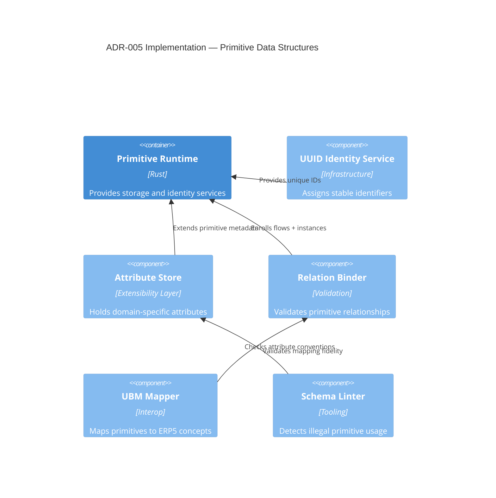

# ADR-005 — Primitive Implementation Components

Implementation view focusing on data structures and extensibility for the five primitives.

- Related: [Primitive creation sequence](ADR-005-sequence-primitive-creation.md)
