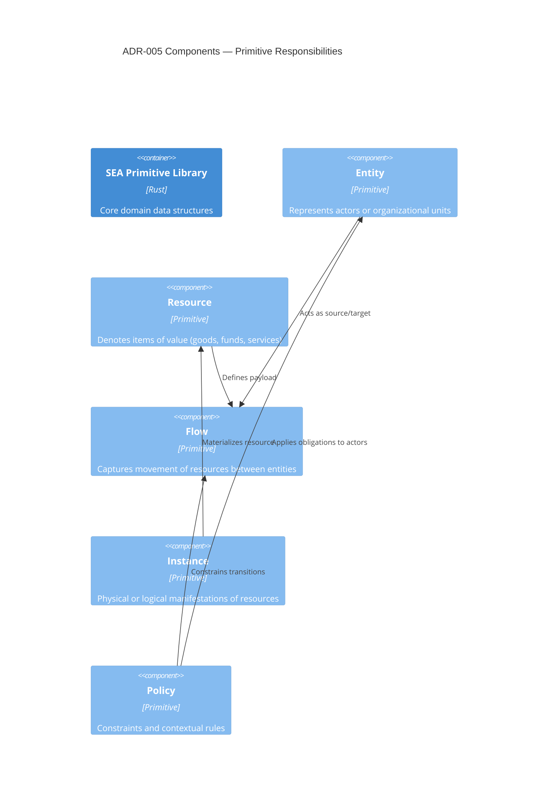

# ADR-005 — Primitive Roles Component View

Component view summarizing responsibilities for each of the five primitives.

- Related: [Implementation data structures](ADR-005-component-primitive-implementation.md)
