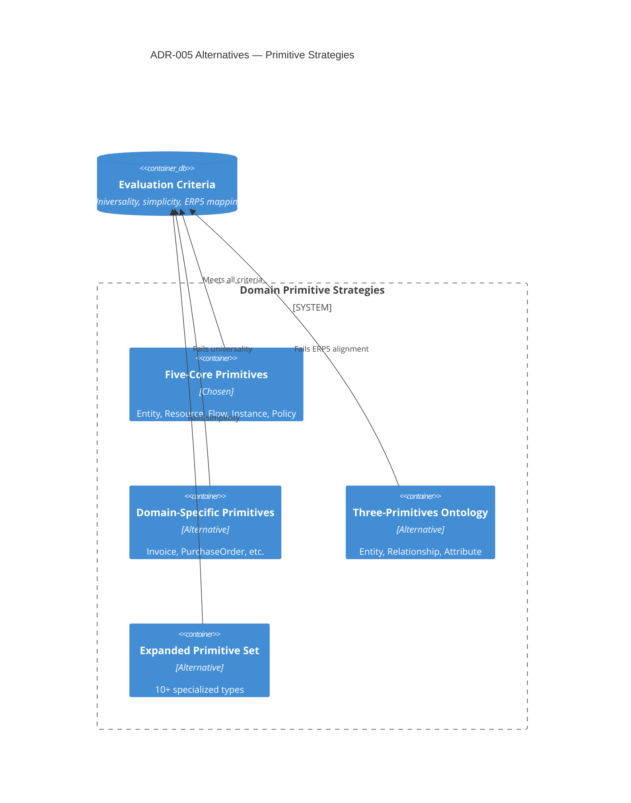

# ADR-005 — Primitive Design Options

Container diagram comparing structural primitive strategies.

```mermaid
%% Source: ADR-005 - Five Core Primitives Design Pattern
%% Generated: 2025-11-01
%% Section: Alternatives
%% Diagram: C4Container
%% !include https://raw.githubusercontent.com/plantuml-stdlib/C4-PlantUML/main/C4_Container.puml
C4Container
  title ADR-005 Alternatives — Primitive Strategies
  System_Boundary(options, "Domain Primitive Strategies") {
    Container(fivePrimitive, "Five-Core Primitives", "Chosen", "Entity, Resource, Flow, Instance, Policy")
    Container(domainSpecific, "Domain-Specific Primitives", "Alternative", "Invoice, PurchaseOrder, etc.")
    Container(minimalPrimitive, "Three-Primitives Ontology", "Alternative", "Entity, Relationship, Attribute")
    Container(expandedPrimitive, "Expanded Primitive Set", "Alternative", "10+ specialized types")
  }
  ContainerDb(criteria, "Evaluation Criteria", "Universality, simplicity, ERP5 mapping")
  Rel(fivePrimitive, criteria, "Meets all criteria")
  Rel(domainSpecific, criteria, "Fails universality")
  Rel(minimalPrimitive, criteria, "Fails ERP5 alignment")
  Rel(expandedPrimitive, criteria, "Fails simplicity")
```

- Related: [Decision validation flow](ADR-005-flow-decision-selection.md)
