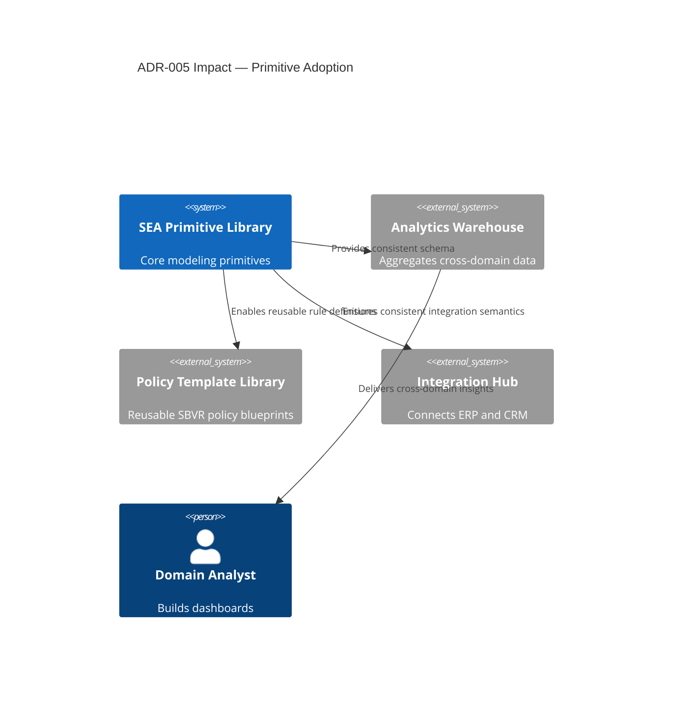

# ADR-005 — Adoption Context

Context diagram depicting systems leveraging the universal primitives.

```mermaid
%% Source: ADR-005 - Five Core Primitives Design Pattern
%% Generated: 2025-11-01
%% Section: Impact
%% Diagram: C4Context
%% !include https://raw.githubusercontent.com/plantuml-stdlib/C4-PlantUML/main/C4_Context.puml
C4Context
  title ADR-005 Impact — Primitive Adoption
  System(seaPrimitives, "SEA Primitive Library", "Core modeling primitives")
  System_Ext(dataWarehouse, "Analytics Warehouse", "Aggregates cross-domain data")
  System_Ext(policyTemplate, "Policy Template Library", "Reusable SBVR policy blueprints")
  System_Ext(integrationHub, "Integration Hub", "Connects ERP and CRM")
  Person(domainAnalyst, "Domain Analyst", "Builds dashboards")
  Rel(seaPrimitives, dataWarehouse, "Provides consistent schema")
  Rel(seaPrimitives, policyTemplate, "Enables reusable rule definitions")
  Rel(seaPrimitives, integrationHub, "Ensures consistent integration semantics")
  Rel(dataWarehouse, domainAnalyst, "Delivers cross-domain insights")
```

- Related: [Universality impact flow](ADR-005-flow-impact-universality.md)
