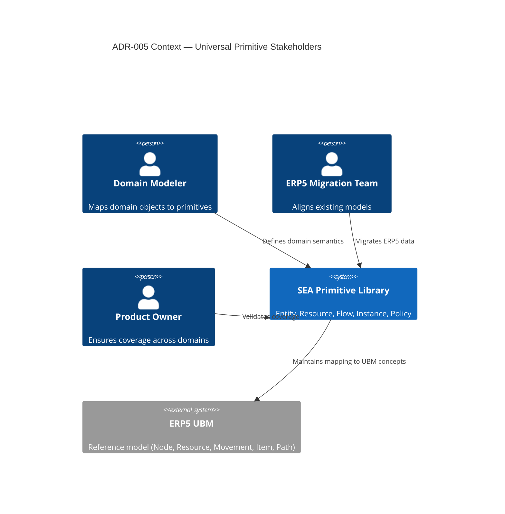

# ADR-005 — Universal Model Context

Context diagram capturing stakeholders who rely on universal primitives.

```mermaid
%% Source: ADR-005 - Five Core Primitives Design Pattern
%% Generated: 2025-11-01
%% Section: Context
%% Diagram: C4Context
%% !include https://raw.githubusercontent.com/plantuml-stdlib/C4-PlantUML/main/C4_Context.puml
C4Context
  title ADR-005 Context — Universal Primitive Stakeholders
  Person(modeler, "Domain Modeler", "Maps domain objects to primitives")
  Person(erp5Team, "ERP5 Migration Team", "Aligns existing models")
  Person(productOwner, "Product Owner", "Ensures coverage across domains")
  System(seaPrimitives, "SEA Primitive Library", "Entity, Resource, Flow, Instance, Policy")
  System_Ext(erp5, "ERP5 UBM", "Reference model (Node, Resource, Movement, Item, Path)")
  Rel(modeler, seaPrimitives, "Defines domain semantics")
  Rel(erp5Team, seaPrimitives, "Migrates ERP5 data")
  Rel(productOwner, seaPrimitives, "Validates coverage")
  Rel(seaPrimitives, erp5, "Maintains mapping to UBM concepts")
```

- Related: [Context driver flow](ADR-005-flow-context-drivers.md)
