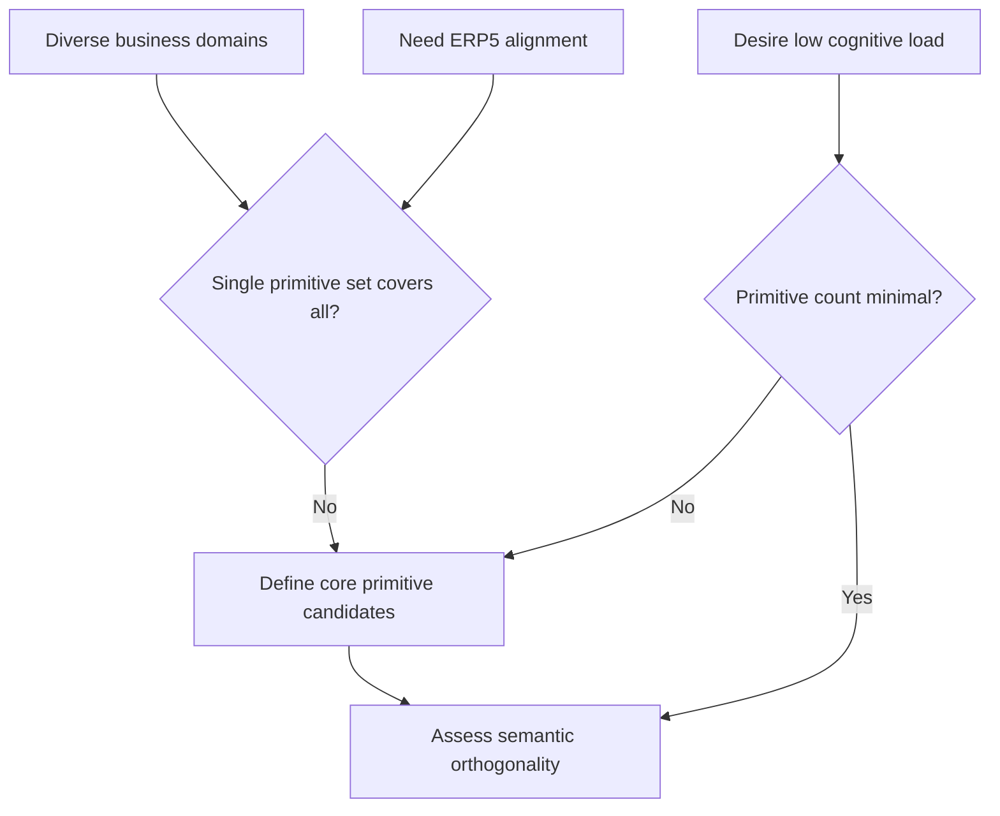

# ADR-005 — Context Driver Flow

Flowchart outlining pressures that require a minimal, universal primitive set.

```mermaid
%% Source: ADR-005 - Five Core Primitives Design Pattern
%% Generated: 2025-11-01
%% Section: Context
%% Diagram: Flowchart
graph TD
  A[Diverse business domains] --> B{Single primitive set covers all?}
  C[Need ERP5 alignment] --> B
  D[Desire low cognitive load] --> E{Primitive count minimal?}
  B -->|No| F[Define core primitive candidates]
  E -->|No| F
  E -->|Yes| G[Assess semantic orthogonality]
  F --> G
```

- Related: [Primitive options comparison](ADR-005-container-primitive-options.md)
