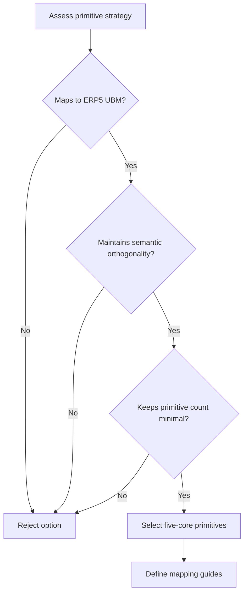

# ADR-005 — Decision Selection Flow

Flowchart showing evaluations leading to the five-core primitive decision.

```mermaid
%% Source: ADR-005 - Five Core Primitives Design Pattern
%% Generated: 2025-11-01
%% Section: Decision
%% Diagram: Flowchart
graph TD
  A[Assess primitive strategy] --> B{Maps to ERP5 UBM?}
  B -->|No| C[Reject option]
  B -->|Yes| D{Maintains semantic orthogonality?}
  D -->|No| C
  D -->|Yes| E{Keeps primitive count minimal?}
  E -->|No| C
  E -->|Yes| F[Select five-core primitives]
  F --> G[Define mapping guides]
```

- Related: [Primitive component landscape](ADR-005-component-primitive-roles.md)
