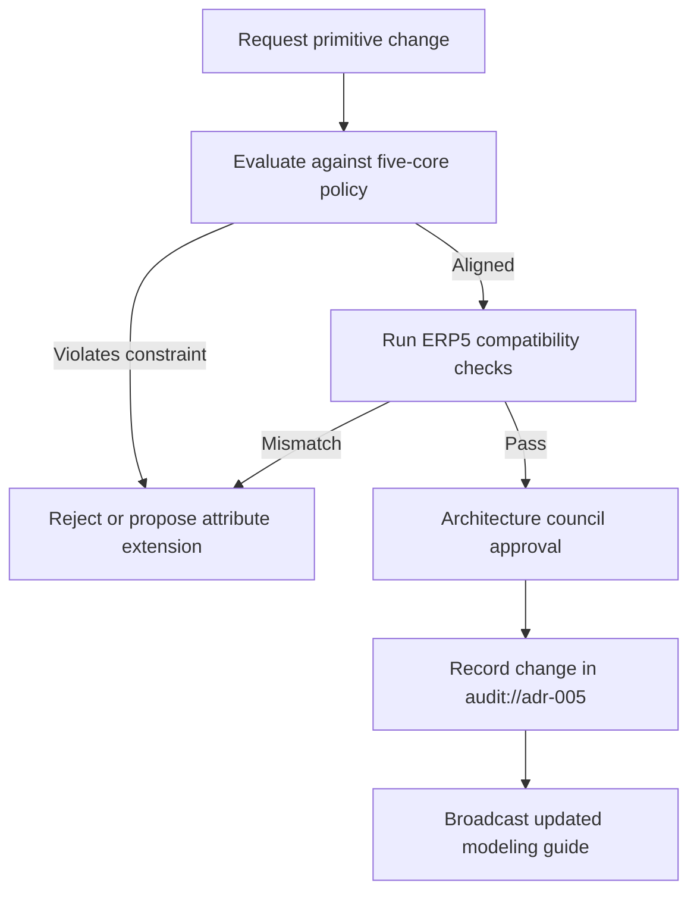

# ADR-005 — Primitive Library Governance Flow

Workflow ensuring controlled evolution of the primitive set.

- Related: [Primitive implementation components](ADR-005-component-primitive-implementation.md)
