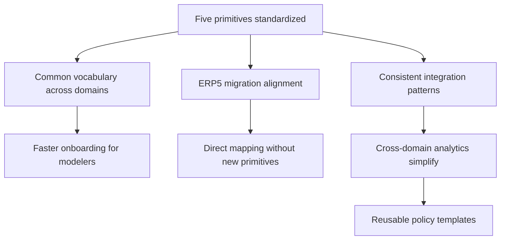

# ADR-005 — Universality Impact Flow

Flowchart mapping how the five primitives improve modeling outcomes.

```mermaid
%% Source: ADR-005 - Five Core Primitives Design Pattern
%% Generated: 2025-11-01
%% Section: Impact
%% Diagram: Flowchart
graph TD
  A[Five primitives standardized] --> B[Common vocabulary across domains]
  B --> C[Faster onboarding for modelers]
  A --> D[ERP5 migration alignment]
  D --> E[Direct mapping without new primitives]
  A --> F[Consistent integration patterns]
  F --> G[Cross-domain analytics simplify]
  G --> H[Reusable policy templates]
```

- Related: [Universal adoption context](ADR-005-context-impact-adoption.md)
