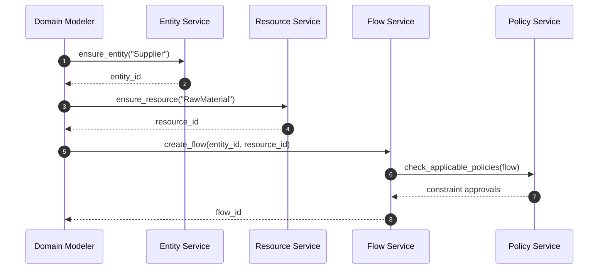

# ADR-005 — Primitive Creation Sequence

Sequence demonstrates how primitives interact during flow creation.

- Related: [Primitive implementation components](ADR-005-component-primitive-implementation.md)
